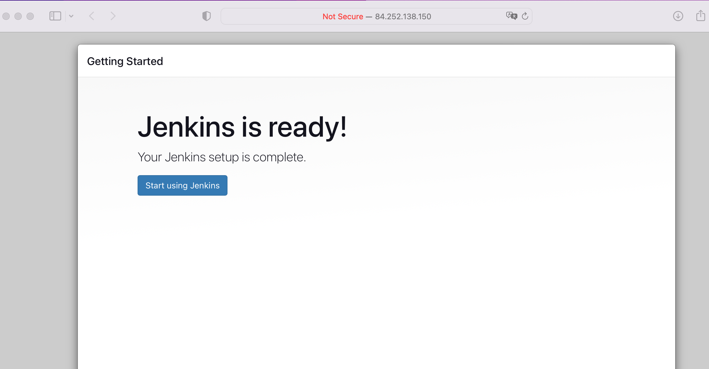
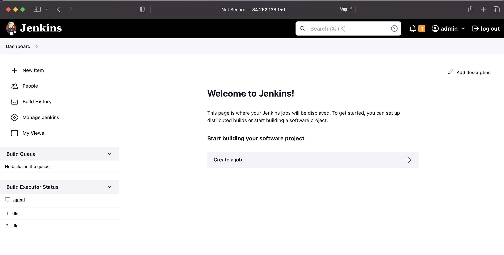
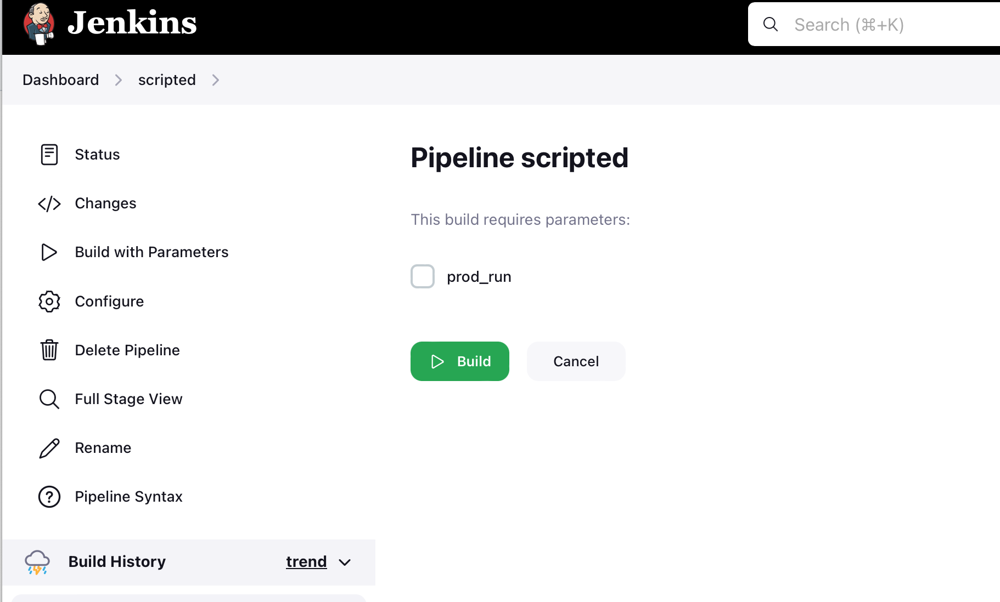

# [Домашнее задание к занятию 10 «Jenkins»](https://github.com/netology-code/mnt-homeworks/blob/MNT-video/09-ci-04-jenkins/README.md)

## Подготовка к выполнению

1. >Создать два VM: для jenkins-master и jenkins-agent.

- 2 VM:
- Centos7
- 2 vCPU
- 4 RAM
- 20 GB

2. >Установить Jenkins при помощи playbook.

```
ansible-playbook -i inventory/cicd/hosts.yml site.yml 

PLAY [Preapre all hosts] **************************************************************************************************************************

TASK [Gathering Facts] ****************************************************************************************************************************
Enter passphrase for key '/Users/Panarin/.ssh/id_rsa': 
ok: [jenkins-agent-01]

ok: [jenkins-master-01]

TASK [Create group] *******************************************************************************************************************************
ok: [jenkins-agent-01]
ok: [jenkins-master-01]

TASK [Create user] ********************************************************************************************************************************
ok: [jenkins-agent-01]
ok: [jenkins-master-01]

TASK [Install JDK] ********************************************************************************************************************************
ok: [jenkins-agent-01]
ok: [jenkins-master-01]

PLAY [Get Jenkins master installed] ***************************************************************************************************************

TASK [Gathering Facts] ****************************************************************************************************************************
ok: [jenkins-master-01]

TASK [Get repo Jenkins] ***************************************************************************************************************************
ok: [jenkins-master-01]

TASK [Add Jenkins key] ****************************************************************************************************************************
ok: [jenkins-master-01]

TASK [Install epel-release] ***********************************************************************************************************************
ok: [jenkins-master-01]

TASK [Install Jenkins and requirements] ***********************************************************************************************************
ok: [jenkins-master-01]

TASK [Ensure jenkins agents are present in known_hosts file] **************************************************************************************
# 51.250.110.3:22 SSH-2.0-OpenSSH_7.4
# 51.250.110.3:22 SSH-2.0-OpenSSH_7.4
# 51.250.110.3:22 SSH-2.0-OpenSSH_7.4
# 51.250.110.3:22 SSH-2.0-OpenSSH_7.4
# 51.250.110.3:22 SSH-2.0-OpenSSH_7.4
ok: [jenkins-master-01] => (item=jenkins-agent-01)

TASK [Start Jenkins] ******************************************************************************************************************************
skipping: [jenkins-master-01]

PLAY [Prepare jenkins agent] **********************************************************************************************************************

TASK [Gathering Facts] ****************************************************************************************************************************
ok: [jenkins-agent-01]

TASK [Add master publickey into authorized_key] ***************************************************************************************************
ok: [jenkins-agent-01]

TASK [Create agent_dir] ***************************************************************************************************************************
ok: [jenkins-agent-01]

TASK [Add docker repo] ****************************************************************************************************************************
ok: [jenkins-agent-01]

TASK [Install some required] **********************************************************************************************************************
ok: [jenkins-agent-01]

TASK [Update pip] *********************************************************************************************************************************
ok: [jenkins-agent-01]

TASK [Install Ansible] ****************************************************************************************************************************
ok: [jenkins-agent-01]

TASK [Reinstall Selinux] **************************************************************************************************************************
changed: [jenkins-agent-01]

TASK [Add local to PATH] **************************************************************************************************************************
ok: [jenkins-agent-01]

TASK [Create docker group] ************************************************************************************************************************
ok: [jenkins-agent-01]

TASK [Add jenkinsuser to dockergroup] *************************************************************************************************************
ok: [jenkins-agent-01]

TASK [Restart docker] *****************************************************************************************************************************
changed: [jenkins-agent-01]

TASK [Install agent.jar] **************************************************************************************************************************
ok: [jenkins-agent-01]

PLAY RECAP ****************************************************************************************************************************************
jenkins-agent-01           : ok=17   changed=2    unreachable=0    failed=0    skipped=0    rescued=0    ignored=0   
jenkins-master-01          : ok=10   changed=0    unreachable=0    failed=0    skipped=1    rescued=0    ignored=0 
```

3. >Запустить и проверить работоспособность.

- Доступ по порту 8080



4. >Сделать первоначальную настройку.

- Установил плагин `Command Agent Launcher Plugin`
- Подключил ноду `agent`



## Основная часть

### 1. Freestyle Job

> Сделать Freestyle Job, который будет запускать `molecule test` из любого вашего репозитория с ролью.

#### Делаем Freestyle Job:
- На странице `Dashboard` нажимаем `New Item`
- Открывшемся окне заполняем поле `Enter an item name` и выбираем из предлагаемы тип `Freestyle project`
- Конфигурация
    - `Source Code Management`
        - `git` = true
        -  `Repository URL` = https://github.com/networksuperman/vector-role.git
        - `Branch Specifier (blank for 'any')` = */main
    - `Build Steps`
        - `Execute shell` = molecule test


#### Запускаем
Console Output:
```
Started by user admin
Running as SYSTEM
Building remotely on agent (linux ansible) in workspace /opt/jenkins_agent/workspace/freestyle
The recommended git tool is: NONE
No credentials specified
Cloning the remote Git repository
Cloning repository https://github.com/networksuperman/vector-role.git
 > git init /opt/jenkins_agent/workspace/freestyle # timeout=10
Fetching upstream changes from https://github.com/networksuperman/vector-role.git
 > git --version # timeout=10
 > git --version # 'git version 1.8.3.1'
 > git fetch --tags --progress https://github.com/networksuperman/vector-role.git +refs/heads/*:refs/remotes/origin/* # timeout=10
 > git config remote.origin.url https://github.com/networksuperman/vector-role.git # timeout=10
 > git config --add remote.origin.fetch +refs/heads/*:refs/remotes/origin/* # timeout=10
Avoid second fetch
 > git rev-parse refs/remotes/origin/main^{commit} # timeout=10
Checking out Revision 7624bea055c016699155bd60c384b4553dbdd3ae (refs/remotes/origin/main)
 > git config core.sparsecheckout # timeout=10
 > git checkout -f 7624bea055c016699155bd60c384b4553dbdd3ae # timeout=10
Commit message: "HM 08-ansible-testing add molecula tests"
First time build. Skipping changelog.
[freestyle] $ /bin/sh -xe /tmp/jenkins14338841348830325896.sh
+ echo /usr/local/bin:/usr/bin:/home/jenkins/.local/bin
/usr/local/bin:/usr/bin:/home/jenkins/.local/bin
+ ls -la
total 8
drwxr-xr-x. 11 jenkins users 167 Jul 29 05:41 .
drwxr-xr-x.  3 jenkins users  23 Jul 29 05:12 ..
drwxr-xr-x.  2 jenkins users  22 Jul 29 05:41 defaults
drwxr-xr-x.  8 jenkins users 162 Jul 29 05:41 .git
drwxr-xr-x.  2 jenkins users  22 Jul 29 05:41 handlers
drwxr-xr-x.  2 jenkins users  22 Jul 29 05:41 meta
drwxr-xr-x.  3 jenkins users  21 Jul 29 05:41 molecule
-rw-r--r--.  1 jenkins users 359 Jul 29 05:41 README.md
drwxr-xr-x.  2 jenkins users  22 Jul 29 05:41 tasks
drwxr-xr-x.  3 jenkins users  20 Jul 29 05:41 templates
drwxr-xr-x.  2 jenkins users  39 Jul 29 05:41 tests
drwxr-xr-x.  2 jenkins users  22 Jul 29 05:41 vars
-rw-r--r--.  1 jenkins users 598 Jul 29 05:41 .yamllint
+ molecule test
/tmp/jenkins14338841348830325896.sh: line 4: molecule: command not found
Build step 'Execute shell' marked build as failure
Finished: FAILURE
```

#### Устанавливаю на агенте 
- Установка molecula `pip3 install "molecule==3.5.2"`
- Устанавливаю плагин docker `python3 -m pip install "molecule-plugins[docker]"`
- Устанавлива `pip3 install ansible-lint yamllint`

#### Повторный запуск:
Console Output:
```
Started by user admin
Running as SYSTEM
Building remotely on agent (linux ansible) in workspace /opt/jenkins_agent/workspace/freestyle
The recommended git tool is: NONE
No credentials specified
 > git rev-parse --resolve-git-dir /opt/jenkins_agent/workspace/freestyle/.git # timeout=10
Fetching changes from the remote Git repository
 > git config remote.origin.url https://github.com/networksuperman/vector-role.git # timeout=10
Fetching upstream changes from https://github.com/networksuperman/vector-role.git
 > git --version # timeout=10
 > git --version # 'git version 1.8.3.1'
 > git fetch --tags --progress https://github.com/networksuperman/vector-role.git +refs/heads/*:refs/remotes/origin/* # timeout=10
 > git rev-parse refs/remotes/origin/main^{commit} # timeout=10
Checking out Revision 7624bea055c016699155bd60c384b4553dbdd3ae (refs/remotes/origin/main)
 > git config core.sparsecheckout # timeout=10
 > git checkout -f 7624bea055c016699155bd60c384b4553dbdd3ae # timeout=10
Commit message: "HM 08-ansible-testing add molecula tests"
 > git rev-list --no-walk 7624bea055c016699155bd60c384b4553dbdd3ae # timeout=10
[freestyle] $ /bin/sh -xe /tmp/jenkins2180011006640732678.sh
+ whoami
jenkins
+ pwd
/opt/jenkins_agent/workspace/freestyle
+ molecule test
/home/jenkins/.local/lib/python3.6/site-packages/requests/__init__.py:104: RequestsDependencyWarning: urllib3 (1.26.16) or chardet (5.0.0)/charset_normalizer (2.0.12) doesn't match a supported version!
  RequestsDependencyWarning)
/usr/local/lib/python3.6/site-packages/ansible/parsing/vault/__init__.py:44: CryptographyDeprecationWarning: Python 3.6 is no longer supported by the Python core team. Therefore, support for it is deprecated in cryptography. The next release of cryptography will remove support for Python 3.6.
  from cryptography.exceptions import InvalidSignature
INFO     default scenario test matrix: dependency, lint, cleanup, destroy, syntax, create, prepare, converge, idempotence, side_effect, verify, cleanup, destroy
INFO     Performing prerun...
INFO     Set ANSIBLE_LIBRARY=/home/jenkins/.cache/ansible-compat/e90229/modules:/home/jenkins/.ansible/plugins/modules:/usr/share/ansible/plugins/modules
INFO     Set ANSIBLE_COLLECTIONS_PATH=/home/jenkins/.cache/ansible-compat/e90229/collections:/home/jenkins/.ansible/collections:/usr/share/ansible/collections
INFO     Set ANSIBLE_ROLES_PATH=/home/jenkins/.cache/ansible-compat/e90229/roles:/home/jenkins/.ansible/roles:/usr/share/ansible/roles:/etc/ansible/roles
INFO     Running default > dependency
WARNING  Skipping, missing the requirements file.
WARNING  Skipping, missing the requirements file.
INFO     Running default > lint
COMMAND: ansible-lint.
yamllint.

/bin/sh: ansible-lint.: command not found
/bin/sh: line 1: yamllint.: command not found
CRITICAL Lint failed with error code 127
WARNING  An error occurred during the test sequence action: 'lint'. Cleaning up.
INFO     Running default > cleanup
WARNING  Skipping, cleanup playbook not configured.
INFO     Running default > destroy
INFO     Sanity checks: 'docker'

PLAY [Destroy] *****************************************************************

TASK [Destroy molecule instance(s)] ********************************************
/usr/local/lib/python3.6/site-packages/ansible/parsing/vault/__init__.py:44: CryptographyDeprecationWarning: Python 3.6 is no longer supported by the Python core team. Therefore, support for it is deprecated in cryptography. The next release of cryptography will remove support for Python 3.6.
  from cryptography.exceptions import InvalidSignature
changed: [localhost] => (item=centos7)

TASK [Wait for instance(s) deletion to complete] *******************************
FAILED - RETRYING: Wait for instance(s) deletion to complete (300 retries left).
ok: [localhost] => (item=centos7)

TASK [Delete docker networks(s)] ***********************************************

PLAY RECAP *********************************************************************
localhost                  : ok=2    changed=1    unreachable=0    failed=0    skipped=1    rescued=0    ignored=0

INFO     Pruning extra files from scenario ephemeral directory
Build step 'Execute shell' marked build as failure
Finished: FAILURE
```

#### Error:
```
/bin/sh: ansible-lint.: command not found
```
Не видит `ansible-lint` , установку делал из под `jenkins`
```
ansible-lint --version
WARNING: PATH altered to include /usr/bin
/usr/local/lib/python3.6/site-packages/ansible/parsing/vault/__init__.py:44: CryptographyDeprecationWarning: Python 3.6 is no longer supported by the Python core team. Therefore, support for it is deprecated in cryptography. The next release of cryptography will remove support for Python 3.6.
  from cryptography.exceptions import InvalidSignature
ansible-lint 5.4.0 using ansible 2.10.17
```

### 2. Declarative Pipeline Job
> Сделать Declarative Pipeline Job, который будет запускать `molecule test` из любого вашего репозитория с ролью.

####  Declarative Pipeline Job:
- На странице `Dashboard` нажимаем `New Item`
- Открывшемся окне заполняем поле `Enter an item name` и выбираем из предлагаемы тип `Pipeline`
- Конфигурация
    - `Pipeline`
        - `Definition` = `Piplene script for SCM`
            - `SCM` = `git`
                - `Repository URL` = `https://github.com/networksuperman/vector-role.git`
                - `Branch Specifier (blank for 'any')` = `*/main`
            - `Script Path` = `Jenkinsfile`

#### Создал в корне репозитория [Jenkinsfile](https://github.com/networksuperman/vector-role/blob/main/Jenkinsfile)
```jenkins
pipeline {
    agent any

    stages {
        stage('First') {
            steps {
                echo 'First step'
                sh 'pwd'
                sh 'whoami'
            }
        }
        stage('Second') {
            steps {
                echo 'Second step'
                sh 'molecule test'
            }
        }
    }
}
```

#### Запускаем 
Console Output:
```shell
Started by user admin
Obtained Jenkinsfile from git https://github.com/networksuperman/vector-role.git
[Pipeline] Start of Pipeline
[Pipeline] node
Running on agent in /opt/jenkins_agent/workspace/declarative
[Pipeline] {
[Pipeline] stage
[Pipeline] { (Declarative: Checkout SCM)
[Pipeline] checkout
Selected Git installation does not exist. Using Default
The recommended git tool is: NONE
No credentials specified
Fetching changes from the remote Git repository
Checking out Revision aee07494098e319e7b0d8abf1c68ed1d85e6d2fc (refs/remotes/origin/main)
Commit message: "add jenkins file"
First time build. Skipping changelog.
[Pipeline] }
[Pipeline] // stage
[Pipeline] withEnv
[Pipeline] {
[Pipeline] stage
[Pipeline] { (First)
 > git rev-parse --resolve-git-dir /opt/jenkins_agent/workspace/declarative/.git # timeout=10
 > git config remote.origin.url https://github.com/networksuperman/vector-role.git # timeout=10
Fetching upstream changes from https://github.com/networksuperman/vector-role.git
 > git --version # timeout=10
 > git --version # 'git version 1.8.3.1'
 > git fetch --tags --progress https://github.com/networksuperman/vector-role.git +refs/heads/*:refs/remotes/origin/* # timeout=10
 > git rev-parse refs/remotes/origin/main^{commit} # timeout=10
 > git config core.sparsecheckout # timeout=10
 > git checkout -f aee07494098e319e7b0d8abf1c68ed1d85e6d2fc # timeout=10
[Pipeline] echo
First step
[Pipeline] sh
+ pwd
/opt/jenkins_agent/workspace/declarative
[Pipeline] sh
+ whoami
jenkins
[Pipeline] }
[Pipeline] // stage
[Pipeline] stage
[Pipeline] { (Second)
[Pipeline] echo
Second step
[Pipeline] sh
+ molecule test
/home/jenkins/.local/lib/python3.6/site-packages/requests/__init__.py:104: RequestsDependencyWarning: urllib3 (1.26.16) or chardet (5.0.0)/charset_normalizer (2.0.12) doesn't match a supported version!
  RequestsDependencyWarning)
/usr/local/lib/python3.6/site-packages/ansible/parsing/vault/__init__.py:44: CryptographyDeprecationWarning: Python 3.6 is no longer supported by the Python core team. Therefore, support for it is deprecated in cryptography. The next release of cryptography will remove support for Python 3.6.
  from cryptography.exceptions import InvalidSignature
INFO     default scenario test matrix: dependency, lint, cleanup, destroy, syntax, create, prepare, converge, idempotence, side_effect, verify, cleanup, destroy
INFO     Performing prerun...
INFO     Set ANSIBLE_LIBRARY=/home/jenkins/.cache/ansible-compat/569ae5/modules:/home/jenkins/.ansible/plugins/modules:/usr/share/ansible/plugins/modules
INFO     Set ANSIBLE_COLLECTIONS_PATH=/home/jenkins/.cache/ansible-compat/569ae5/collections:/home/jenkins/.ansible/collections:/usr/share/ansible/collections
INFO     Set ANSIBLE_ROLES_PATH=/home/jenkins/.cache/ansible-compat/569ae5/roles:/home/jenkins/.ansible/roles:/usr/share/ansible/roles:/etc/ansible/roles
INFO     Running default > dependency
INFO     Running ansible-galaxy collection install -v --force community.docker:>=1.9.1
WARNING  Skipping, missing the requirements file.
WARNING  Skipping, missing the requirements file.
INFO     Running default > lint
COMMAND: ansible-lint.
yamllint.

/bin/sh: ansible-lint.: command not found
/bin/sh: line 1: yamllint.: command not found
CRITICAL Lint failed with error code 127
WARNING  An error occurred during the test sequence action: 'lint'. Cleaning up.
INFO     Running default > cleanup
WARNING  Skipping, cleanup playbook not configured.
INFO     Running default > destroy
INFO     Sanity checks: 'docker'

PLAY [Destroy] *****************************************************************

TASK [Destroy molecule instance(s)] ********************************************
/usr/local/lib/python3.6/site-packages/ansible/parsing/vault/__init__.py:44: CryptographyDeprecationWarning: Python 3.6 is no longer supported by the Python core team. Therefore, support for it is deprecated in cryptography. The next release of cryptography will remove support for Python 3.6.
  from cryptography.exceptions import InvalidSignature
changed: [localhost] => (item=centos7)

TASK [Wait for instance(s) deletion to complete] *******************************
FAILED - RETRYING: Wait for instance(s) deletion to complete (300 retries left).
ok: [localhost] => (item=centos7)

TASK [Delete docker networks(s)] ***********************************************

PLAY RECAP *********************************************************************
localhost                  : ok=2    changed=1    unreachable=0    failed=0    skipped=1    rescued=0    ignored=0

INFO     Pruning extra files from scenario ephemeral directory
[Pipeline] }
[Pipeline] // stage
[Pipeline] }
[Pipeline] // withEnv
[Pipeline] }
[Pipeline] // node
[Pipeline] End of Pipeline
ERROR: script returned exit code 1
Finished: FAILURE
```

Error:
```
/bin/sh: ansible-lint.: command not found
```
Не видит `ansible-lint` установку делал из под `jenkins`
```
ansible-lint --version
WARNING: PATH altered to include /usr/bin
/usr/local/lib/python3.6/site-packages/ansible/parsing/vault/__init__.py:44: CryptographyDeprecationWarning: Python 3.6 is no longer supported by the Python core team. Therefore, support for it is deprecated in cryptography. The next release of cryptography will remove support for Python 3.6.
  from cryptography.exceptions import InvalidSignature
ansible-lint 5.4.0 using ansible 2.10.17
```

### 3. Declarative Pipeline 
> Перенести Declarative Pipeline в репозиторий в файл `Jenkinsfile`.

Сделано во втором пункте.

### 4. Multibranch Pipeline
> Создать Multibranch Pipeline на запуск `Jenkinsfile` из репозитория.

#### Declarative Pipeline Job:
- На странице `Dashboard` нажимаем `New Item`
- Открывшемся окне заполняем поле `Enter an item name` и выбираем из предлагаемы тип `Multibranch Pipeline`
- Конфигурация
    - `Branch Sources`
        - `Repository HTTPS URL` = `https://github.com/networksuperman/vector-role.git`
            - `SCM` = `git`
                - `Repository URL` = `https://github.com/networksuperman/vector-role.git`
    - `Build Configuration`
        - `Mode`= `by Jenkinsfile`
            - `Script Path` = `Jenkinsfile`

#### Запуск произошёл сразу после создания `Multibranch Pipeline`
Console Output
```shell
Branch indexing
10:01:22 Connecting to https://api.github.com with no credentials, anonymous access
Obtained Jenkinsfile from aee07494098e319e7b0d8abf1c68ed1d85e6d2fc
[Pipeline] Start of Pipeline
[Pipeline] node
Running on agent in /opt/jenkins_agent/workspace/multibranch_main
[Pipeline] {
[Pipeline] stage
[Pipeline] { (Declarative: Checkout SCM)
[Pipeline] checkout
Selected Git installation does not exist. Using Default
The recommended git tool is: NONE
No credentials specified
Cloning the remote Git repository
Cloning with configured refspecs honoured and without tags
Avoid second fetch
Checking out Revision aee07494098e319e7b0d8abf1c68ed1d85e6d2fc (main)
Commit message: "add jenkins file"
First time build. Skipping changelog.
[Pipeline] }
[Pipeline] // stage
[Pipeline] withEnv
[Pipeline] {
[Pipeline] stage
[Pipeline] { (First)
[Pipeline] echo
First step
Cloning repository https://github.com/networksuperman/vector-role.git
 > git init /opt/jenkins_agent/workspace/multibranch_main # timeout=10
Fetching upstream changes from https://github.com/networksuperman/vector-role.git
 > git --version # timeout=10
 > git --version # 'git version 1.8.3.1'
 > git fetch --no-tags --progress https://github.com/networksuperman/vector-role.git +refs/heads/main:refs/remotes/origin/main # timeout=10
 > git config remote.origin.url https://github.com/networksuperman/vector-role.git # timeout=10
 > git config --add remote.origin.fetch +refs/heads/main:refs/remotes/origin/main # timeout=10
 > git config core.sparsecheckout # timeout=10
 > git checkout -f aee07494098e319e7b0d8abf1c68ed1d85e6d2fc # timeout=10
[Pipeline] sh
+ pwd
/opt/jenkins_agent/workspace/multibranch_main
[Pipeline] sh
+ whoami
jenkins
[Pipeline] }
[Pipeline] // stage
[Pipeline] stage
[Pipeline] { (Second)
[Pipeline] echo
Second step
[Pipeline] sh
+ molecule test
/home/jenkins/.local/lib/python3.6/site-packages/requests/__init__.py:104: RequestsDependencyWarning: urllib3 (1.26.16) or chardet (5.0.0)/charset_normalizer (2.0.12) doesn't match a supported version!
  RequestsDependencyWarning)
/usr/local/lib/python3.6/site-packages/ansible/parsing/vault/__init__.py:44: CryptographyDeprecationWarning: Python 3.6 is no longer supported by the Python core team. Therefore, support for it is deprecated in cryptography. The next release of cryptography will remove support for Python 3.6.
  from cryptography.exceptions import InvalidSignature
INFO     default scenario test matrix: dependency, lint, cleanup, destroy, syntax, create, prepare, converge, idempotence, side_effect, verify, cleanup, destroy
INFO     Performing prerun...
INFO     Set ANSIBLE_LIBRARY=/home/jenkins/.cache/ansible-compat/8320fc/modules:/home/jenkins/.ansible/plugins/modules:/usr/share/ansible/plugins/modules
INFO     Set ANSIBLE_COLLECTIONS_PATH=/home/jenkins/.cache/ansible-compat/8320fc/collections:/home/jenkins/.ansible/collections:/usr/share/ansible/collections
INFO     Set ANSIBLE_ROLES_PATH=/home/jenkins/.cache/ansible-compat/8320fc/roles:/home/jenkins/.ansible/roles:/usr/share/ansible/roles:/etc/ansible/roles
INFO     Running default > dependency
INFO     Running ansible-galaxy collection install -v --force community.docker:>=1.9.1
WARNING  Skipping, missing the requirements file.
WARNING  Skipping, missing the requirements file.
INFO     Running default > lint
COMMAND: ansible-lint.
yamllint.

/bin/sh: ansible-lint.: command not found
/bin/sh: line 1: yamllint.: command not found
CRITICAL Lint failed with error code 127
WARNING  An error occurred during the test sequence action: 'lint'. Cleaning up.
INFO     Running default > cleanup
WARNING  Skipping, cleanup playbook not configured.
INFO     Running default > destroy
INFO     Sanity checks: 'docker'

PLAY [Destroy] *****************************************************************

TASK [Destroy molecule instance(s)] ********************************************
/usr/local/lib/python3.6/site-packages/ansible/parsing/vault/__init__.py:44: CryptographyDeprecationWarning: Python 3.6 is no longer supported by the Python core team. Therefore, support for it is deprecated in cryptography. The next release of cryptography will remove support for Python 3.6.
  from cryptography.exceptions import InvalidSignature
changed: [localhost] => (item=centos7)

TASK [Wait for instance(s) deletion to complete] *******************************
FAILED - RETRYING: Wait for instance(s) deletion to complete (300 retries left).
ok: [localhost] => (item=centos7)

TASK [Delete docker networks(s)] ***********************************************

PLAY RECAP *********************************************************************
localhost                  : ok=2    changed=1    unreachable=0    failed=0    skipped=1    rescued=0    ignored=0

INFO     Pruning extra files from scenario ephemeral directory
[Pipeline] }
[Pipeline] // stage
[Pipeline] }
[Pipeline] // withEnv
[Pipeline] }
[Pipeline] // node
[Pipeline] End of Pipeline
ERROR: script returned exit code 1
Finished: FAILURE
```

### 5. Scripted Pipeline
> Создать Scripted Pipeline, наполнить его скриптом из [pipeline](./pipeline).

Создал, нужно заменить `credentialsId` на свой.

6. Внести необходимые изменения, чтобы Pipeline запускал `ansible-playbook` без флагов `--check --diff`, если не установлен параметр при запуске джобы (prod_run = True). По умолчанию параметр имеет значение False и запускает прогон с флагами `--check --diff`.



```groovy
node("linux"){
    stage("Git checkout"){
        git credentialsId: '0d2b46f4-b05f-4ea2-9d53-705420c18312', url: 'git@github.com:aragastmatb/example-playbook.git'
    }
    
    stage("Run playbook"){
        if (prod_run == 'true'){
            sh 'ansible-playbook site.yml -i inventory/prod.yml'
        } else {
            sh 'ansible-playbook site.yml -i inventory/prod.yml --check --diff'
        }
        
    }
}
```

### 7. Проверяем работоспособность 
> Проверить работоспособность, исправить ошибки, исправленный Pipeline вложить в репозиторий в файл `ScriptedJenkinsfile`.

Console Output
```shell
Started by user admin
[Pipeline] Start of Pipeline
[Pipeline] node
Running on agent in /opt/jenkins_agent/workspace/scripted
[Pipeline] {
[Pipeline] stage
[Pipeline] { (Git checkout)
[Pipeline] git
The recommended git tool is: NONE
using credential 0d2b46f4-b05f-4ea2-9d53-705420c18312
Fetching changes from the remote Git repository
 > git rev-parse --resolve-git-dir /opt/jenkins_agent/workspace/scripted/.git # timeout=10
 > git config remote.origin.url git@github.com:aragastmatb/example-playbook.git # timeout=10
Fetching upstream changes from git@github.com:aragastmatb/example-playbook.git
 > git --version # timeout=10
 > git --version # 'git version 1.8.3.1'
using GIT_SSH to set credentials 
[INFO] Currently running in a labeled security context
[INFO] Currently SELinux is 'enforcing' on the host
 > /usr/bin/chcon --type=ssh_home_t /opt/jenkins_agent/workspace/scripted@tmp/jenkins-gitclient-ssh847223022100988530.key
Verifying host key using known hosts file
 > git fetch --tags --progress git@github.com:aragastmatb/example-playbook.git +refs/heads/*:refs/remotes/origin/* # timeout=10
Checking out Revision 20bd8d945340bb742acdd9e8c1a8fb5b73cc1700 (refs/remotes/origin/master)
Commit message: "Merge branch 'master' of https://github.com/aragastmatb/example-playbook"
 > git rev-parse refs/remotes/origin/master^{commit} # timeout=10
 > git config core.sparsecheckout # timeout=10
 > git checkout -f 20bd8d945340bb742acdd9e8c1a8fb5b73cc1700 # timeout=10
 > git branch -a -v --no-abbrev # timeout=10
 > git branch -D master # timeout=10
 > git checkout -b master 20bd8d945340bb742acdd9e8c1a8fb5b73cc1700 # timeout=10
 > git rev-list --no-walk 20bd8d945340bb742acdd9e8c1a8fb5b73cc1700 # timeout=10
[Pipeline] }
[Pipeline] // stage
[Pipeline] stage
[Pipeline] { (Sample define secret_check)
[Pipeline] }
[Pipeline] // stage
[Pipeline] stage
[Pipeline] { (Run playbook)
[Pipeline] sh
+ ansible-playbook site.yml -i inventory/prod.yml --check --diff

PLAY [Install Java] ************************************************************

TASK [Gathering Facts] *********************************************************
/usr/local/lib/python3.6/site-packages/ansible/parsing/vault/__init__.py:44: CryptographyDeprecationWarning: Python 3.6 is no longer supported by the Python core team. Therefore, support for it is deprecated in cryptography. The next release of cryptography will remove support for Python 3.6.
  from cryptography.exceptions import InvalidSignature
ok: [localhost]

TASK [java : Upload .tar.gz file containing binaries from local storage] *******
skipping: [localhost]

TASK [java : Upload .tar.gz file conaining binaries from remote storage] *******
ok: [localhost]

TASK [java : Ensure installation dir exists] ***********************************
fatal: [localhost]: FAILED! => {"changed": false, "module_stderr": "sudo: a password is required\n", "module_stdout": "", "msg": "MODULE FAILURE\nSee stdout/stderr for the exact error", "rc": 1}

PLAY RECAP *********************************************************************
localhost                  : ok=2    changed=0    unreachable=0    failed=1    skipped=1    rescued=0    ignored=0   

[Pipeline] }
[Pipeline] // stage
[Pipeline] }
[Pipeline] // node
[Pipeline] End of Pipeline
ERROR: script returned exit code 2
Finished: FAILURE
```
#### Действия на `jenkins-agent`
- Добавил юзера `jenkins` в `sudoers` чтобы не было запроса пароля.
- Создал директорию `/opt/jdk/openjdk-11/`

#### Повторный запуск
Console Output
```shell
Started by user admin
[Pipeline] Start of Pipeline
[Pipeline] node
Running on agent in /opt/jenkins_agent/workspace/scripted
[Pipeline] {
[Pipeline] stage
[Pipeline] { (Git checkout)
[Pipeline] git
The recommended git tool is: NONE
using credential 0d2b46f4-b05f-4ea2-9d53-705420c18312
Fetching changes from the remote Git repository
 > git rev-parse --resolve-git-dir /opt/jenkins_agent/workspace/scripted/.git # timeout=10
 > git config remote.origin.url git@github.com:aragastmatb/example-playbook.git # timeout=10
Fetching upstream changes from git@github.com:aragastmatb/example-playbook.git
 > git --version # timeout=10
 > git --version # 'git version 1.8.3.1'
using GIT_SSH to set credentials 
[INFO] Currently running in a labeled security context
[INFO] Currently SELinux is 'enforcing' on the host
 > /usr/bin/chcon --type=ssh_home_t /opt/jenkins_agent/workspace/scripted@tmp/jenkins-gitclient-ssh11026700394847242166.key
Verifying host key using known hosts file
 > git fetch --tags --progress git@github.com:aragastmatb/example-playbook.git +refs/heads/*:refs/remotes/origin/* # timeout=10
Checking out Revision 20bd8d945340bb742acdd9e8c1a8fb5b73cc1700 (refs/remotes/origin/master)
Commit message: "Merge branch 'master' of https://github.com/aragastmatb/example-playbook"
 > git rev-parse refs/remotes/origin/master^{commit} # timeout=10
 > git config core.sparsecheckout # timeout=10
 > git checkout -f 20bd8d945340bb742acdd9e8c1a8fb5b73cc1700 # timeout=10
 > git branch -a -v --no-abbrev # timeout=10
 > git branch -D master # timeout=10
 > git checkout -b master 20bd8d945340bb742acdd9e8c1a8fb5b73cc1700 # timeout=10
 > git rev-list --no-walk 20bd8d945340bb742acdd9e8c1a8fb5b73cc1700 # timeout=10
[Pipeline] }
[Pipeline] // stage
[Pipeline] stage
[Pipeline] { (Sample define secret_check)
[Pipeline] }
[Pipeline] // stage
[Pipeline] stage
[Pipeline] { (Run playbook)
[Pipeline] sh
+ ansible-playbook site.yml -i inventory/prod.yml --check --diff

PLAY [Install Java] ************************************************************

TASK [Gathering Facts] *********************************************************
/usr/local/lib/python3.6/site-packages/ansible/parsing/vault/__init__.py:44: CryptographyDeprecationWarning: Python 3.6 is no longer supported by the Python core team. Therefore, support for it is deprecated in cryptography. The next release of cryptography will remove support for Python 3.6.
  from cryptography.exceptions import InvalidSignature
ok: [localhost]

TASK [java : Upload .tar.gz file containing binaries from local storage] *******
skipping: [localhost]

TASK [java : Upload .tar.gz file conaining binaries from remote storage] *******
ok: [localhost]

TASK [java : Ensure installation dir exists] ***********************************
--- before
+++ after
@@ -1,4 +1,4 @@
 {
-    "mode": "0766",
+    "mode": "0755",
     "path": "/opt/jdk/openjdk-11"
 }

changed: [localhost]

TASK [java : Extract java in the installation directory] ***********************
skipping: [localhost]

TASK [java : Export environment variables] *************************************
--- before
+++ after: /home/jenkins/.ansible/tmp/ansible-local-3290w35is7yf/tmpdjztloay/jdk.sh.j2
@@ -0,0 +1,5 @@
+# Warning: This file is Ansible Managed, manual changes will be overwritten on next playbook run.
+#!/usr/bin/env bash
+
+export JAVA_HOME=/opt/jdk/openjdk-11
+export PATH=$PATH:$JAVA_HOME/bin
\ No newline at end of file

changed: [localhost]

PLAY RECAP *********************************************************************
localhost                  : ok=4    changed=2    unreachable=0    failed=0    skipped=2    rescued=0    ignored=0   

[Pipeline] }
[Pipeline] // stage
[Pipeline] }
[Pipeline] // node
[Pipeline] End of Pipeline
Finished: SUCCESS
```

### 8. Завершение 
> Отправить ссылку на репозиторий с ролью и Declarative Pipeline и Scripted Pipeline.

- Репозиторий с ролью - https://github.com/networksuperman/vector-role
- Declarative Pipeline - https://github.com/networksuperman/vector-role/blob/main/Jenkinsfile
- Scripted Pipeline - [ScryptedJenkinsfile](./ScryptedJenkinsfile)

---
