## Основная часть

### DevOps

В репозитории содержится код проекта на python. Проект - RESTful API сервис. Ваша задача автоматизировать сборку образа с выполнением python-скрипта:
1. Образ собирается на основе [centos:7](https://hub.docker.com/_/centos?tab=tags&page=1&ordering=last_updated)
2. Python версии не ниже 3.7
3. Установлены зависимости: `flask` `flask-jsonpify` `flask-restful`
4. Создана директория `/python_api`
5. Скрипт из репозитория размещён в /python_api
6. Точка вызова: запуск скрипта

### Product Owner

Вашему проекту нужна бизнесовая доработка: необходимо поменять JSON ответа на вызов метода GET `/rest/api/get_info`, необходимо создать Issue в котором указать:
1. Какой метод необходимо исправить
2. Текст с `{ "message": "Already started" }` на `{ "message": "Running"}`
3. Issue поставить label: feature

### Developer

Пришел новый Issue на доработку, вам необходимо:
1. Создать отдельную ветку, связанную с этим issue
2. Внести изменения по тексту из задания
3. Подготовить Merge Requst, влить необходимые изменения в `master`, проверить, что сборка прошла успешно

### Tester

Разработчики выполнили новый Issue, необходимо проверить валидность изменений:
1. Поднять докер-контейнер с образом `python-api:latest` и проверить возврат метода на корректность
2. Закрыть Issue с комментарием об успешности прохождения, указав желаемый результат и фактически достигнутый

## Итог

В качестве ответа пришлите подробные скриншоты по каждому пункту задания:
1. файл gitlab-ci.yml;
2. Dockerfile;
3. лог успешного выполнения пайплайна;
4. решённый Issue.

## Важно
После выполнения задания выключите и удалите все задействованные ресурсы в Yandex Cloud.

### Ответ

- Подготовил gitlab по инструкции  
    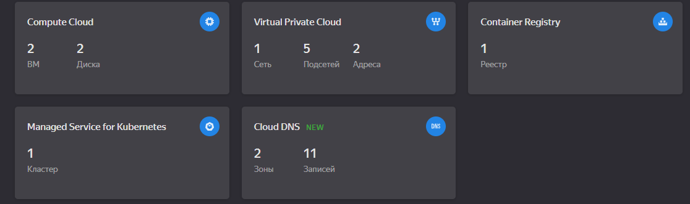  
- Создал новый проект, репозиторий и наполнил его файлом  
    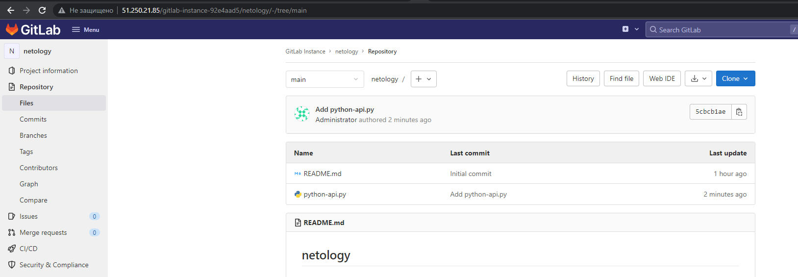  

#### DevOps

- Подготовил [образ docker](./src/Dockerfile)
- Сборка на ветке `master` прошла успешно  
    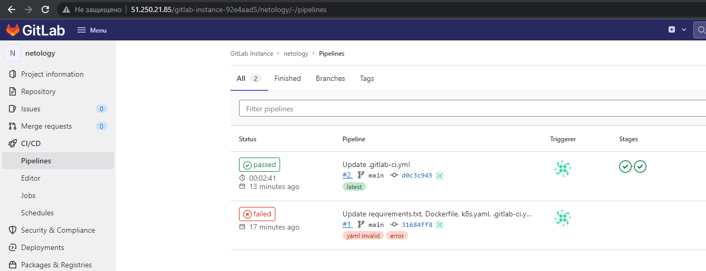  
    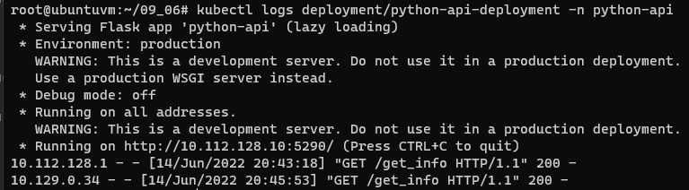  

#### Product Owner

- Создал Issue на бизнесовую доработку  
    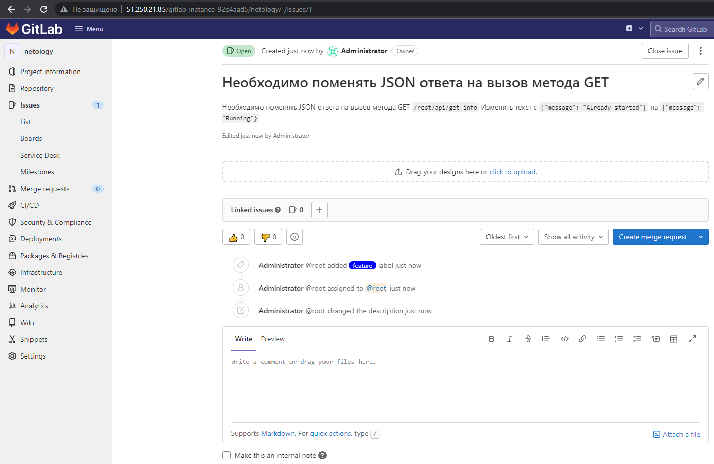   

#### Developer

- Создал отдельную ветку, связанную с этим issue и Merge Requst  
    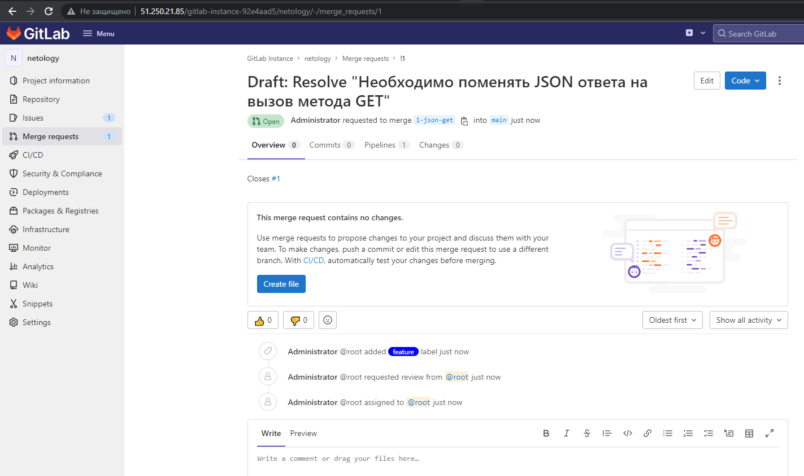  
- Внёс необходимые изменения, сборка на отдельной ветке прошла успешно  
    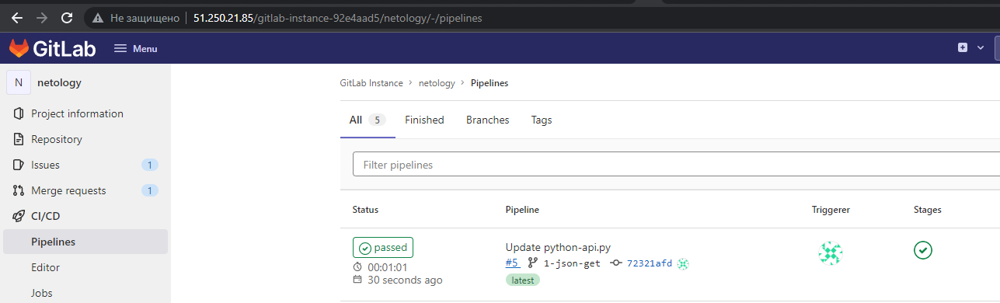  
- Влил необходимые изменения в `master`  
    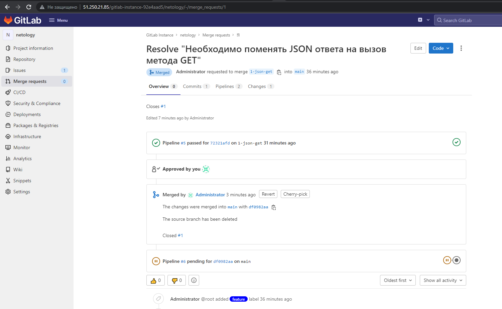  
    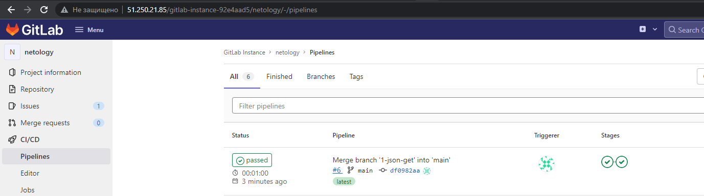  

#### Tester

- Контейнер с образом `python-api:latest` поднялся  
    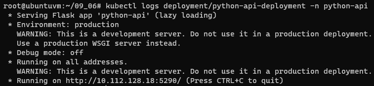  
- Возврат метода ожидаемый  
    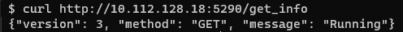  
- Закрыл Issue  
    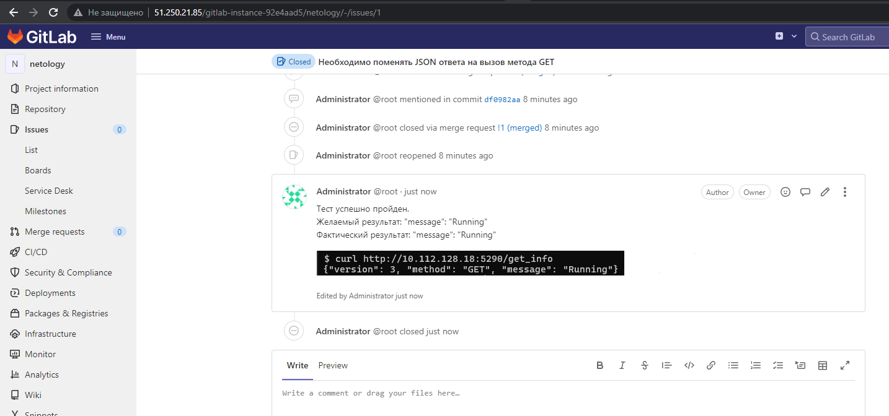  
  
