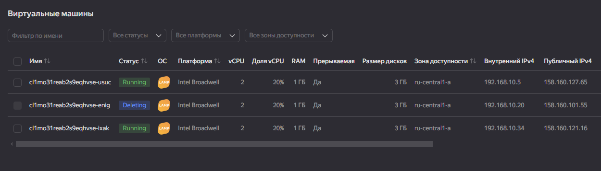

# Домашнее задание к занятию «Вычислительные мощности. Балансировщики нагрузки»  

### Подготовка к выполнению задания

1. Домашнее задание состоит из обязательной части, которую нужно выполнить на провайдере Yandex Cloud, и дополнительной части в AWS (выполняется по желанию). 
2. Все домашние задания в блоке 15 связаны друг с другом и в конце представляют пример законченной инфраструктуры.  
3. Все задания нужно выполнить с помощью Terraform. Результатом выполненного домашнего задания будет код в репозитории. 
4. Перед началом работы настройте доступ к облачным ресурсам из Terraform, используя материалы прошлых лекций и домашних заданий.

---
## Задание 1. Yandex Cloud 

**Что нужно сделать**

1. Создать бакет Object Storage и разместить в нём файл с картинкой:

 - Создать бакет в Object Storage с произвольным именем (например, _имя_студента_дата_).
 - Положить в бакет файл с картинкой.
 - Сделать файл доступным из интернета.
 
2. Создать группу ВМ в public подсети фиксированного размера с шаблоном LAMP и веб-страницей, содержащей ссылку на картинку из бакета:

 - Создать Instance Group с тремя ВМ и шаблоном LAMP. Для LAMP рекомендуется использовать `image_id = fd827b91d99psvq5fjit`.
 - Для создания стартовой веб-страницы рекомендуется использовать раздел `user_data` в [meta_data](https://cloud.yandex.ru/docs/compute/concepts/vm-metadata).
 - Разместить в стартовой веб-странице шаблонной ВМ ссылку на картинку из бакета.
 - Настроить проверку состояния ВМ.
 
3. Подключить группу к сетевому балансировщику:

 - Создать сетевой балансировщик.
 - Проверить работоспособность, удалив одну или несколько ВМ.
4. (дополнительно)* Создать Application Load Balancer с использованием Instance group и проверкой состояния.

Полезные документы:

- [Compute instance group](https://registry.terraform.io/providers/yandex-cloud/yandex/latest/docs/resources/compute_instance_group).
- [Network Load Balancer](https://registry.terraform.io/providers/yandex-cloud/yandex/latest/docs/resources/lb_network_load_balancer).
- [Группа ВМ с сетевым балансировщиком](https://cloud.yandex.ru/docs/compute/operations/instance-groups/create-with-balancer).

---
#### Решение

- Конфигурация [Бакета](./configs/bucket.tf)  

- Скрин Бакета из YC  
  

Полученная ссылка для скачивания -  http://panarin-netology-bucket.storage.yandexcloud.net/netology.png  

- Конфигурация [Instance Group](./configs/instance-group.tf)

- Скрин Instance Group  


- Скрин Target Group
 


- Скрин картинки на инстансах из Instance Group 


- Конфигурация [load-balancer](./configs/lb.tf)

- Проверка работоспособности при удалении одной машины




- Все созданные ресурсы


Terraform apply
```
 terraform apply -auto-approve

Terraform used the selected providers to generate the following execution
plan. Resource actions are indicated with the following symbols:

Apply complete! Resources: 11 added, 0 changed, 0 destroyed.

Outputs:

bucket_domain_name = "http://panarin-netology-bucket.storage.yandexcloud.net/netology.png"
external_load_balancer_ip = "158.160.172.141"
```
### Общая конфигурация [Terraform](https://github.com/networksuperman/netology_dev_ops/tree/main/clopro/15.2/configs)


