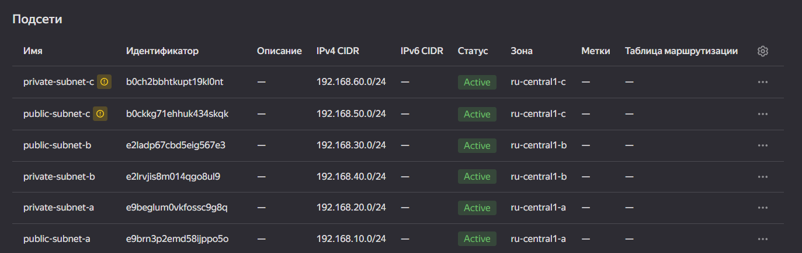
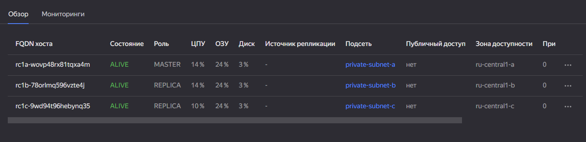
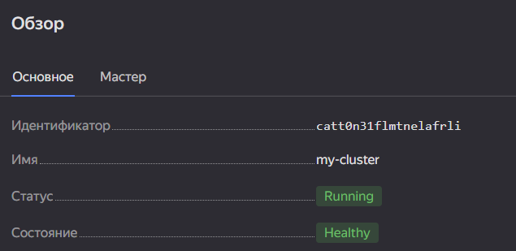
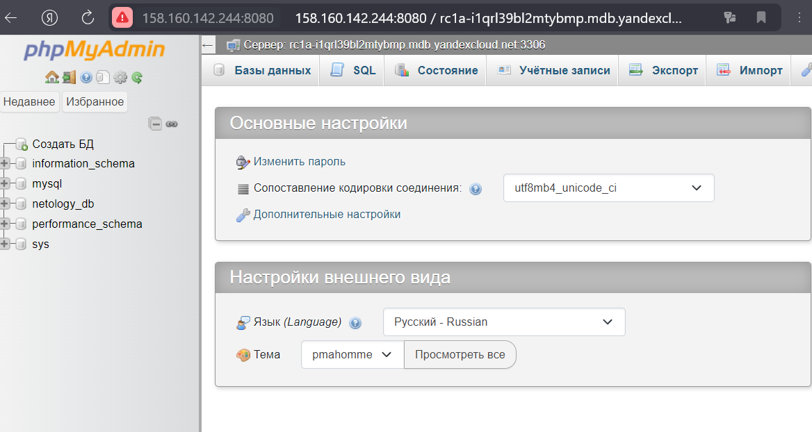

# Домашнее задание к занятию «Кластеры. Ресурсы под управлением облачных провайдеров»

### Цели задания 

1. Организация кластера Kubernetes и кластера баз данных MySQL в отказоустойчивой архитектуре.
2. Размещение в private подсетях кластера БД, а в public — кластера Kubernetes.

---
## Задание 1. Yandex Cloud

1. Настроить с помощью Terraform кластер баз данных MySQL.

 - Используя настройки VPC из предыдущих домашних заданий, добавить дополнительно подсеть private в разных зонах, чтобы обеспечить отказоустойчивость. 
 - Разместить ноды кластера MySQL в разных подсетях.
 - Необходимо предусмотреть репликацию с произвольным временем технического обслуживания.
 - Использовать окружение Prestable, платформу Intel Broadwell с производительностью 50% CPU и размером диска 20 Гб.
 - Задать время начала резервного копирования — 23:59.
 - Включить защиту кластера от непреднамеренного удаления.
 - Создать БД с именем `netology_db`, логином и паролем.

## Решение  
```
terraform apply --auto-approve

Apply complete! Resources: 10 added, 0 changed, 0 destroyed.

Outputs:

mysql = "rc1a-wovp48rx81tqxa4m.mdb.yandexcloud.net"
```
Проверим  

  

  

------

2. Настроить с помощью Terraform кластер Kubernetes.

 - Используя настройки VPC из предыдущих домашних заданий, добавить дополнительно две подсети public в разных зонах, чтобы обеспечить отказоустойчивость.
 - Создать отдельный сервис-аккаунт с необходимыми правами. 
 - Создать региональный мастер Kubernetes с размещением нод в трёх разных подсетях.
 - Добавить возможность шифрования ключом из KMS, созданным в предыдущем домашнем задании.
 - Создать группу узлов, состояющую из трёх машин с автомасштабированием до шести.
 - Подключиться к кластеру с помощью `kubectl`.
 - *Запустить микросервис phpmyadmin и подключиться к ранее созданной БД.
 - *Создать сервис-типы Load Balancer и подключиться к phpmyadmin. Предоставить скриншот с публичным адресом и подключением к БД.

## Решение  

```
terraform apply --auto-approve

Apply complete! Resources: 19 added, 0 changed, 0 destroyed.

Outputs:

k8s_id = "catt0n31flmtnelafrli"
k8s_url = "https://158.160.145.83"
mysql = "rc1a-i1qrl39bl2mtybmp.mdb.yandexcloud.net"
```
Подключаемся по kubectl `yc managed-kubernetes cluster get-credentials --id catt0n31flmtnelafrli --external` и выполняем `kubectl apply -f pmyadm.yaml`
```
kubectl apply -f pmyadm.yaml
deployment.apps/phpmyadmin-deployment created
service/phpmyadmin created

kubectl get all
NAME                                        READY   STATUS    RESTARTS   AGE
pod/phpmyadmin-deployment-bb95f7df7-hlthz   1/1     Running   0          73s

NAME                 TYPE           CLUSTER-IP     EXTERNAL-IP       PORT(S)          AGE
service/kubernetes   ClusterIP      10.96.128.1    <none>            443/TCP          13m
service/phpmyadmin   LoadBalancer   10.96.135.92   158.160.142.244   8080:32279/TCP   72s

NAME                                    READY   UP-TO-DATE   AVAILABLE   AGE
deployment.apps/phpmyadmin-deployment   1/1     1            1           73s

NAME                                              DESIRED   CURRENT   READY   AGE
replicaset.apps/phpmyadmin-deployment-bb95f7df7   1         1         1       73s
```




[Конфиги](https://github.com/networksuperman/netology_dev_ops/tree/main/clopro/15.4/configs)  
