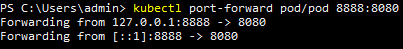

# Домашнее задание к занятию «Базовые объекты K8S»
1. Manifest файл: [pod.yml](./kubernetes%20manifests/pod.yml)  
   Pod запущен:  
   
   Проброс порта:  
     
   Вывод браузера:  
     

2. Manifest файл: [netology-web.yml](./kubernetes%20manifests/netology-web.yml)  
   pod и service запущены:  
     
   Проброс порта:  
     
   Вывод браузера:
   