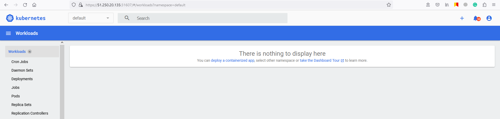

## Домашнее задание к занятию «Kubernetes. Причины появления. Команда kubectl»

------

### Задание 1. Установка MicroK8S

1. Установить MicroK8S на локальную машину или на удалённую виртуальную машину.
2. Установить dashboard.
3. Сгенерировать сертификат для подключения к внешнему ip-адресу.

#### Ответ:
MicroK8S установлен:  
     
   Dashboard установлен:  
     
   Генерация сертификата после добавления внешнего IP адреса в файл ```/var/snap/microk8s/current/certs/csr.conf.template```:  
     

------

### Задание 2. Установка и настройка локального kubectl
1. Установить на локальную машину kubectl.
2. Настроить локально подключение к кластеру.
3. Подключиться к дашборду с помощью port-forward.

#### Ответ:
Kubectl установлен:  
     
   Конфиг для kubectl получил при помощи команды ```microk8s config```:  
     
   И успешно подключился:  
     
   Открыл Dashboard наружу не при помощи Port-forward, а изменив сервис дашборда на Nodeport:  
     
   И успешно подключился к дашборду по внешнему ip адресу сервера:  
   
------
