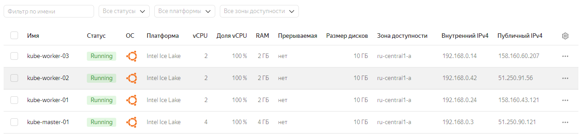

# Домашнее задание к занятию «Как работает сеть в K8s»

### Цель задания

Настроить сетевую политику доступа к подам.

### Чеклист готовности к домашнему заданию

1. Кластер K8s с установленным сетевым плагином Calico.

### Инструменты и дополнительные материалы, которые пригодятся для выполнения задания

1. [Документация Calico](https://www.tigera.io/project-calico/).
2. [Network Policy](https://kubernetes.io/docs/concepts/services-networking/network-policies/).
3. [About Network Policy](https://docs.projectcalico.org/about/about-network-policy).

-----

### Задание 1. Создать сетевую политику или несколько политик для обеспечения доступа

1. Создать deployment'ы приложений frontend, backend и cache и соответсвующие сервисы.
2. В качестве образа использовать network-multitool.
3. Разместить поды в namespace App.
4. Создать политики, чтобы обеспечить доступ frontend -> backend -> cache. Другие виды подключений должны быть запрещены.
5. Продемонстрировать, что трафик разрешён и запрещён.

------

### Решение  

1. Создадим виртуальные машины в Яндекс Облако: 1 master и 3 worker ноды.

  

3. На `kube-master-01` выполняем:

* Подготовим kubespray (для переменной `IPS` указываем IP-адреса виртуальных машин в Яндекс Облако, начиная с мастер-ноды):
```
apt-get update -y
apt-get install git pip -y
git clone https://github.com/kubernetes-sigs/kubespray
cd kubespray
pip3 install -r requirements.txt
cp -rfp inventory/sample inventory/mycluster
declare -a IPS=(192.168.0.3 192.168.0.24 192.168.0.42 192.168.0.14)
```
* Генерируем inventory-файл `hosts.yaml` для Ansible с использованием заданной переменной `IPS`:
```
root@kube-master-01:~/kubespray# CONFIG_FILE=inventory/mycluster/hosts.yaml python3 contrib/inventory_builder/inventory.py ${IPS[@]}
DEBUG: Adding group all
DEBUG: Adding group kube_control_plane
DEBUG: Adding group kube_node
DEBUG: Adding group etcd
DEBUG: Adding group k8s_cluster
DEBUG: Adding group calico_rr
DEBUG: adding host node1 to group all
DEBUG: adding host node2 to group all
DEBUG: adding host node3 to group all
DEBUG: adding host node4 to group all
DEBUG: adding host node1 to group etcd
DEBUG: adding host node2 to group etcd
DEBUG: adding host node3 to group etcd
DEBUG: adding host node1 to group kube_control_plane
DEBUG: adding host node2 to group kube_control_plane
DEBUG: adding host node1 to group kube_node
DEBUG: adding host node2 to group kube_node
DEBUG: adding host node3 to group kube_node
DEBUG: adding host node4 to group kube_node
```
* В inventory-файл `hosts.yaml` сделает так, чтобы `node1` был master, остальные - worker. Etcd оставляем только на мастере:
```
root@kube-master-01:~/kubespray# cat inventory/mycluster/hosts.yaml
all:
  hosts:
    node1:
      ansible_host: 192.168.0.3
      ip: 192.168.0.3
      access_ip: 192.168.0.3
    node2:
      ansible_host: 192.168.0.24
      ip: 192.168.0.24
      access_ip: 192.168.0.24
    node3:
      ansible_host: 192.168.0.42
      ip: 192.168.0.42
      access_ip: 192.168.0.42
    node4:
      ansible_host: 192.168.0.14
      ip: 192.168.0.14
      access_ip: 192.168.0.14
  children:
    kube_control_plane:
      hosts:
        node1:
    kube_node:
      hosts:
        node2:
        node3:
        node4:
    etcd:
      hosts:
        node1:
    k8s_cluster:
      children:
        kube_control_plane:
        kube_node:
    calico_rr:
      hosts: {}
```
* Копируем закрытый ключ на master:
```
rsync --rsync-path="sudo rsync" /root/.ssh/id_rsa admin@51.250.90.121:/root/.ssh/id_rsa
```
Проверим
```
root@kube-master-01:~# ls .ssh/
authorized_keys  id_rsa
```
3. Применяем конфигурацию Ansible для узлов кластера и создадим kubeconfig-файл для пользователя admin:
```
root@kube-master-01:~/kubespray# ansible-playbook -i inventory/mycluster/hosts.yaml -u admin -b -v --private-key=/root/.ssh/id_rsa cluster.yml
------ ВЫВОД ------
TASK [network_plugin/calico : Check if inventory match current cluster configuration] *******************************************************************************************************************************************************
ok: [node1] => {
    "changed": false,
    "msg": "All assertions passed"
}
Tuesday 18 June 2024 10:15:23 +0000 (0:00:00.131)       0:19:43.797 ********
Tuesday 18 June 2024 10:15:23 +0000 (0:00:00.060)       0:19:43.858 ********
Tuesday 18 June 2024 10:15:23 +0000 (0:00:00.045)       0:19:43.903 ********

PLAY RECAP **********************************************************************************************************************************************************************************************************************************
localhost                  : ok=3    changed=0    unreachable=0    failed=0    skipped=0    rescued=0    ignored=0
node1                      : ok=754  changed=150  unreachable=0    failed=0    skipped=1280 rescued=0    ignored=8
node2                      : ok=514  changed=94   unreachable=0    failed=0    skipped=780  rescued=0    ignored=1
node3                      : ok=514  changed=94   unreachable=0    failed=0    skipped=779  rescued=0    ignored=1
node4                      : ok=514  changed=94   unreachable=0    failed=0    skipped=779  rescued=0    ignored=1
```
* Создадим и настроим kubeconfig-файла для пользователя admin:
```
admin@kube-master-01:~$ mkdir -p $HOME/.kube
admin@kube-master-01:~$ sudo cp -i /etc/kubernetes/admin.conf $HOME/.kube/config
admin@kube-master-01:~$ sudo chown $(id -u):$(id -g) $HOME/.kube/config
```
4. Проверим состояние нод в кластере Kubernetes:
```
admin@kube-master-01:~$ kubectl get nodes
NAME    STATUS   ROLES           AGE     VERSION
node1   Ready    control-plane   9m27s   v1.28.2
node2   Ready    <none>          8m34s   v1.28.2
node3   Ready    <none>          8m29s   v1.28.2
node4   Ready    <none>          8m29s   v1.28.2
```
5. Проверим состояние подов в кластере Kubernetes. Видим в списке подов, что в качестве сетевого плагина используется calico. 
```
admin@kube-master-01:~$ kubectl get po -A
NAMESPACE     NAME                                       READY   STATUS    RESTARTS   AGE
kube-system   calico-kube-controllers-5fb8ccdcd6-kmxjj   1/1     Running   0          14m
kube-system   calico-node-5qcv4                          1/1     Running   0          16m
kube-system   calico-node-7949w                          1/1     Running   0          16m
kube-system   calico-node-9msxv                          1/1     Running   0          16m
kube-system   calico-node-dgs7f                          1/1     Running   0          16m
kube-system   coredns-67cb94d654-bkv4s                   1/1     Running   0          14m
kube-system   coredns-67cb94d654-jkc25                   1/1     Running   0          14m
kube-system   dns-autoscaler-7b6c6d8b5b-2j9jg            1/1     Running   0          14m
kube-system   kube-apiserver-node1                       1/1     Running   1          17m
kube-system   kube-controller-manager-node1              1/1     Running   2          17m
kube-system   kube-proxy-hrgfk                           1/1     Running   0          16m
kube-system   kube-proxy-mgdwl                           1/1     Running   0          16m
kube-system   kube-proxy-q256j                           1/1     Running   0          16m
kube-system   kube-proxy-vcfr7                           1/1     Running   0          16m
kube-system   kube-scheduler-node1                       1/1     Running   1          17m
kube-system   nginx-proxy-node2                          1/1     Running   0          16m
kube-system   nginx-proxy-node3                          1/1     Running   0          16m
kube-system   nginx-proxy-node4                          1/1     Running   0          16m
kube-system   nodelocaldns-22lvx                         1/1     Running   0          14m
kube-system   nodelocaldns-82xrs                         1/1     Running   0          14m
kube-system   nodelocaldns-8wqtz                         1/1     Running   0          14m
kube-system   nodelocaldns-s6w8x                         1/1     Running   0          14m
```
6. Создадим namespace `app`
* Опишем конфигурационный файл namespace.yaml:
```
admin@kube-master-01:~$ cat namespace.yaml
apiVersion: v1
kind: Namespace
metadata:
  name: app
```
* Применим конфигурацию:
```
admin@kube-master-01:~$ kubectl create -f namespace.yaml
namespace/app created
admin@kube-master-01:~$ kubectl get namespaces
NAME              STATUS   AGE
app               Active   15s
default           Active   35m
kube-node-lease   Active   35m
kube-public       Active   35m
kube-system       Active   35m
```
7. Создадим deployment и service для приложения `frontend`:
* Опишем конфигурационный файл deployment-frontend.yaml:
```
admin@kube-master-01:~$ cat deployment-frontend.yaml
---
apiVersion: apps/v1
kind: Deployment
metadata:
  labels:
    app: deployment-frontend
  name: deployment-frontend
  namespace: app
spec:
  replicas: 1
  selector:
    matchLabels:
      app: frontend
  template:
    metadata:
      labels:
        app: frontend
    spec:
      containers:
        - name: frontend-multitool
          image: wbitt/network-multitool
```
* Опишем конфигурационный файл service-frontend.yaml:
```
admin@kube-master-01:~$ cat service-frontend.yaml
---
apiVersion: v1
kind: Service
metadata:
  name: service-frontend
  namespace: app
spec:
  selector:
    app: frontend
  ports:
    - name: port-80
      port: 80
      targetPort: 80
```
* Применим deployment и service для приложения `frontend`:
```
admin@kube-master-01:~$ kubectl create -f deployment-frontend.yaml
deployment.apps/deployment-frontend created
admin@kube-master-01:~$ kubectl create -f service-frontend.yaml
service/service-frontend created
```
8. Создадим deployment и service для приложения `backend`:

* Опишем конфигурационный файл deployment-backend.yaml:
```
admin@kube-master-01:~$ cat deployment-backend.yaml
---
apiVersion: apps/v1
kind: Deployment
metadata:
  labels:
    app: deployment-backend
  name: deployment-backend
  namespace: app
spec:
  replicas: 1
  selector:
    matchLabels:
      app: backend
  template:
    metadata:
      labels:
        app: backend
    spec:
      containers:
        - name: backend-multitool
          image: wbitt/network-multitool
```
* Опишем конфигурационный файл service-backend.yaml:
```
admin@kube-master-01:~$ cat service-backend.yaml
---
apiVersion: v1
kind: Service
metadata:
  name: service-backend
  namespace: app
spec:
  selector:
    app: backend
  ports:
    - name: port-80
      port: 80
      targetPort: 80
```
* Применим deployment и service для приложения `backend`:
```
admin@kube-master-01:~$ kubectl create -f deployment-backend.yaml
deployment.apps/deployment-backend created
admin@kube-master-01:~$ kubectl create -f service-backend.yaml
service/service-backend created
```
9. Создадим deployment и service для приложения `cache`:

* Опишем конфигурационный файл deployment-cache.yaml:
```
admin@kube-master-01:~$ cat deployment-cache.yaml
---
apiVersion: apps/v1
kind: Deployment
metadata:
  labels:
    app: deployment-cache
  name: deployment-cache
  namespace: app
spec:
  replicas: 1
  selector:
    matchLabels:
      app: cache
  template:
    metadata:
      labels:
        app: cache
    spec:
      containers:
        - name: cache-multitool
          image: wbitt/network-multitool
```
* Опишем конфигурационный файл service-cache.yaml:
```
admin@kube-master-01:~$ cat service-cache.yaml
---
apiVersion: v1
kind: Service
metadata:
  name: service-cache
  namespace: app
spec:
  selector:
    app: cache
  ports:
    - name: port-80
      port: 80
      targetPort: 80
```
* Применим deployment и service для приложения `cache`:
```
admin@kube-master-01:~$ kubectl create -f deployment-cache.yaml
deployment.apps/deployment-cache created
admin@kube-master-01:~$ kubectl create -f service-cache.yaml
service/service-cache created
```
10. Убедимся в успешности развертывания подов и сервисов:
```
admin@kube-master-01:~$ kubectl get pods,services -n app -o wide
NAME                                      READY   STATUS    RESTARTS   AGE     IP             NODE    NOMINATED NODE   READINESS GATES
pod/deployment-backend-59f8c49bdb-zqcwb   1/1     Running   0          5m33s   10.233.75.3    node2   <none>           <none>
pod/deployment-cache-69b486bc58-8x8db     1/1     Running   0          2m13s   10.233.71.2    node3   <none>           <none>
pod/deployment-frontend-8cc5b69b4-lrxn4   1/1     Running   0          9m31s   10.233.74.66   node4   <none>           <none>

NAME                       TYPE        CLUSTER-IP      EXTERNAL-IP   PORT(S)   AGE     SELECTOR
service/service-backend    ClusterIP   10.233.9.28     <none>        80/TCP    5m25s   app=backend
service/service-cache      ClusterIP   10.233.32.40    <none>        80/TCP    2m6s    app=cache
service/service-frontend   ClusterIP   10.233.17.252   <none>        80/TCP    9m20s   app=frontend
```
11. Перед конфигурированием сетевых политик убедимся, что поды имеют неограниченный доступ друг к другу внутри namespace `app`:
```
admin@kube-master-01:~$ kubectl exec -it service/service-frontend -n app -- curl --silent -i service-backend.app.svc.cluster.local | grep Server
Server: nginx/1.24.0
admin@kube-master-01:~$ kubectl exec -it service/service-backend -n app -- curl --silent -i service-cache.app.svc.cluster.local | grep Server
Server: nginx/1.24.0
admin@kube-master-01:~$ kubectl exec -it service/service-frontend -n app -- curl --silent -i service-cache.app.svc.cluster.local | grep Server
Server: nginx/1.24.0
admin@kube-master-01:~$ kubectl exec -it service/service-cache -n app -- curl --silent -i service-frontend.app.svc.cluster.local | grep Server
Server: nginx/1.24.0
```
12. Создадим и применим сетевую политику, запрещающую подключения, не разрешённые специально:
* Опишем конфигурационный файл netpolicy-default.yaml:
```
admin@kube-master-01:~$ cat netpolicy-default.yaml
---
apiVersion: networking.k8s.io/v1
kind: NetworkPolicy
metadata:
  name: default-deny-ingress
  namespace: app
spec:
  podSelector: {}
  policyTypes:
    - Ingress
```
* Применим политику по умолчанию:
```
admin@kube-master-01:~$ kubectl create -f netpolicy-default.yaml
networkpolicy.networking.k8s.io/default-deny-ingress created
```
13. Создадим и применим сетевую политику, разрешающую подключения от `frontend` к `backend`:
* Опишем конфигурационный файл netpolicy-front-back.yaml:
```
admin@kube-master-01:~$ cat netpolicy-front-back.yaml
---
apiVersion: networking.k8s.io/v1
kind: NetworkPolicy
metadata:
  name: frontend-to-backend-policy
  namespace: app
spec:
  podSelector:
    matchLabels:
      app: backend
  policyTypes:
    - Ingress
  ingress:
    - from:
      - podSelector:
          matchLabels:
            app: frontend
      ports:
        - protocol: TCP
          port: 80
        - protocol: TCP
          port: 443
```
* Применим политику, разрешающую подключения от `frontend` к `backend`:
```
admin@kube-master-01:~$ kubectl create -f netpolicy-front-back.yaml
networkpolicy.networking.k8s.io/frontend-to-backend-policy created
```
14. Создадим и применим сетевую политику, разрешающую подключения от `backend` к `cache`:
* Опишем конфигурационный файл netpolicy-back-cache.yaml:
```
admin@kube-master-01:~$ cat netpolicy-back-cache.yaml
---
apiVersion: networking.k8s.io/v1
kind: NetworkPolicy
metadata:
  name: backend-to-cache-policy
  namespace: app
spec:
  podSelector:
    matchLabels:
      app: cache
  policyTypes:
    - Ingress
  ingress:
    - from:
      - podSelector:
          matchLabels:
            app: backend
      ports:
        - protocol: TCP
          port: 80
        - protocol: TCP
          port: 443
```
* Применим политику, разрешающую подключения от `backend` к `cache`:
```
admin@kube-master-01:~$ kubectl create -f netpolicy-back-cache.yaml
networkpolicy.networking.k8s.io/backend-to-cache-policy created
```
15. Проверим примененные сетевые политики:
```
admin@kube-master-01:~$ kubectl get networkpolicy -A
NAMESPACE   NAME                         POD-SELECTOR   AGE
app         backend-to-cache-policy      app=cache      59s
app         default-deny-ingress         <none>         6m15s
app         frontend-to-backend-policy   app=backend    3m5s
```
16. Проверим работу настроенных сетевых политик:
* Доступ должен быть от `frontend` к `backend`:
```
admin@kube-master-01:~$ kubectl exec -it service/service-frontend -n app -- curl --silent -i service-backend.app.svc.cluster.local | grep Server
Server: nginx/1.24.0
```
* Доступ должен быть от `backend` к `cache`:
```
admin@kube-master-01:~$ kubectl exec -it service/service-backend -n app -- curl --silent -i service-cache.app.svc.cluster.local | grep Server
Server: nginx/1.24.0
```
* Доступа не должно быть в иных случаях:
```
admin@kube-master-01:~$ kubectl exec -it service/service-frontend -n app -- curl --silent -i service-cache.app.svc.cluster.local | grep Server
command terminated with exit code 28
admin@kube-master-01:~$ kubectl exec -it service/service-cache -n app -- curl --silent -i service-frontend.app.svc.cluster.local | grep Server
command terminated with exit code 28
```
* Всё работает корректно. Есть доступ от `frontend` к `backend` и от `backend` к `cache`. Проверено, что нет доступа от `backend` к `cache` и от `cache` к `frontend`. В последних случаях происходит "зависание" на 2 минуты, потом выполнение команды завершается с кодом возврата 28.
