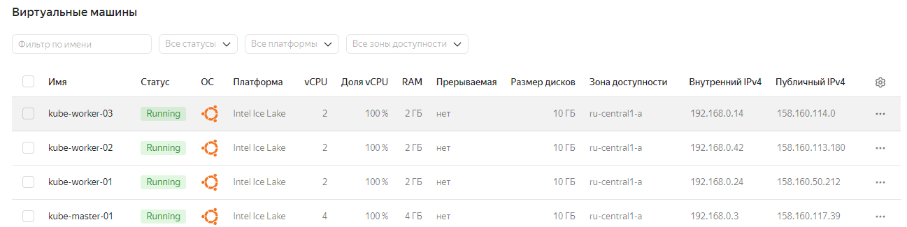

# Домашнее задание к занятию «Обновление приложений»  

### Цель задания  

Выбрать и настроить стратегию обновления приложения.  

### Чеклист готовности к домашнему заданию  

1. Кластер K8s.  

### Инструменты и дополнительные материалы, которые пригодятся для выполнения задания  

1. [Документация Updating a Deployment](https://kubernetes.io/docs/concepts/workloads/controllers/deployment/#updating-a-deployment).  
2. [Статья про стратегии обновлений](https://habr.com/ru/companies/flant/articles/471620/).  

-----

### Задание 1. Выбрать стратегию обновления приложения и описать ваш выбор  

1. Имеется приложение, состоящее из нескольких реплик, которое требуется обновить.  
2. Ресурсы, выделенные для приложения, ограничены, и нет возможности их увеличить.  
3. Запас по ресурсам в менее загруженный момент времени составляет 20%.  
4. Обновление мажорное, новые версии приложения не умеют работать со старыми.  
5. Вам нужно объяснить свой выбор стратегии обновления приложения.  

### Задание 2. Обновить приложение  

1. Создать deployment приложения с контейнерами nginx и multitool. Версию nginx взять 1.19. Количество реплик — 5.  
2. Обновить версию nginx в приложении до версии 1.20, сократив время обновления до минимума. Приложение должно быть доступно.  
3. Попытаться обновить nginx до версии 1.28, приложение должно оставаться доступным.  
4. Откатиться после неудачного обновления.  

-----

### Решение задания 1.    

Выберем вариант обновления recreate из-за ограниченности ресурсов и невозможности их увеличения и несовместимости версий приложения. При таком обновлении сначала будут удалены поды старой версии приложения, потом одномоментно будут развернуты поды новой версии. Это приведёт к недоступности приложения на период обновления, но recreate - вынужденный и оптимальный способ обновления в описанной ситуации.  

  
### Подготовка кластера к решению задания 2  

Создадим виртуальные машины в Яндекс Облако: 1 мастер и 3 рабочие ноды.  
    

Подключимся к виртуальной машине `kube-master-01` и сконфигурируем ее:  

Выполним подготовку kubespray (для переменной `IPS` указываем IP-адреса виртуальных машин в Яндекс Облако, начиная с master ноды):  
```
apt-get update -y
apt-get install git pip -y
git clone https://github.com/kubernetes-sigs/kubespray
cd kubespray
pip3 install -r requirements.txt
cp -rfp inventory/sample inventory/mycluster
declare -a IPS=(192.168.0.3 192.168.0.24 192.168.0.42 192.168.0.14)
```

Сгенерируем inventory-файл `hosts.yaml` для Ansible с использованием заданной переменной `IPS`:  
```
root@node1:~/kubespray# CONFIG_FILE=inventory/mycluster/hosts.yaml python3 contrib/inventory_builder/inventory.py ${IPS[@]}
DEBUG: Adding group all
DEBUG: Adding group kube_control_plane
DEBUG: Adding group kube_node
DEBUG: Adding group etcd
DEBUG: Adding group k8s_cluster
DEBUG: Adding group calico_rr
DEBUG: adding host node1 to group all
DEBUG: adding host node2 to group all
DEBUG: adding host node3 to group all
DEBUG: adding host node4 to group all
DEBUG: adding host node1 to group etcd
DEBUG: adding host node2 to group etcd
DEBUG: adding host node3 to group etcd
DEBUG: adding host node1 to group kube_control_plane
DEBUG: adding host node2 to group kube_control_plane
DEBUG: adding host node1 to group kube_node
DEBUG: adding host node2 to group kube_node
DEBUG: adding host node3 to group kube_node
DEBUG: adding host node4 to group kube_node
```

Скорректируем inventory-файл `hosts.yaml` так, чтобы `node1` был master, остальные - worker. Etcd оставляем только на master:  
```
root@node1:~/kubespray# cat inventory/mycluster/hosts.yaml
all:
  hosts:
    node1:
      ansible_host: 192.168.0.3
      ip: 192.168.0.3
      access_ip: 192.168.0.3
    node2:
      ansible_host: 192.168.0.24
      ip: 192.168.0.24
      access_ip: 192.168.0.24
    node3:
      ansible_host: 192.168.0.42
      ip: 192.168.0.42
      access_ip: 192.168.0.42
    node4:
      ansible_host: 192.168.0.14
      ip: 192.168.0.14
      access_ip: 192.168.0.14
  children:
    kube_control_plane:
      hosts:
        node1:
    kube_node:
      hosts:
        node2:
        node3:
        node4:
    etcd:
      hosts:
        node1:
    k8s_cluster:
      children:
        kube_control_plane:
        kube_node:
    calico_rr:
      hosts: {}
```

Копируем закрытый ключ с локальной машины на master:  
```
[root@workstation ~]# rsync --rsync-path="sudo rsync" /root/.ssh/id_rsa admin@158.160.117.39:/root/.ssh/id_rsa
```

Проверим ключ:  
```
root@node1:~# ls .ssh/
authorized_keys  id_rsa
```

Применим конфигурацию Ansible для узлов кластера и создадим kubeconfig-файл для пользователя admin:  

Результат применения ansible-playbook:  
```
root@node1:~/kubespray# ansible-playbook -i inventory/mycluster/hosts.yaml -u admin -b -v --private-key=/root/.ssh/id_rsa cluster.yml
---------------------------------ВЫВОД ПРОПУЩЕН------------------------------------------
TASK [network_plugin/calico : Check if inventory match current cluster configuration] *******************************************************************************************************************************************************
ok: [node1] => {
    "changed": false,
    "msg": "All assertions passed"
}
Saturday 22 June 2024  13:29:53 +0000 (0:00:00.131)       0:19:43.797 ********
Saturday 22 June 2024  13:29:53 +0000 (0:00:00.060)       0:19:43.858 ********
Saturday 22 June 2024  13:29:53 +0000 (0:00:00.045)       0:19:43.903 ********

PLAY RECAP **********************************************************************************************************************************************************************************************************************************
localhost                  : ok=3    changed=0    unreachable=0    failed=0    skipped=0    rescued=0    ignored=0
node1                      : ok=754  changed=150  unreachable=0    failed=0    skipped=1280 rescued=0    ignored=8
node2                      : ok=514  changed=94   unreachable=0    failed=0    skipped=780  rescued=0    ignored=1
node3                      : ok=514  changed=94   unreachable=0    failed=0    skipped=779  rescued=0    ignored=1
node4                      : ok=514  changed=94   unreachable=0    failed=0    skipped=779  rescued=0    ignored=1

```

Создание и настройка kubeconfig-файла для пользователя admin:  
```
admin@node1:~$ mkdir -p $HOME/.kube
admin@node1:~$ sudo cp -i /etc/kubernetes/admin.conf $HOME/.kube/config
admin@node1:~$ sudo chown $(id -u):$(id -g) $HOME/.kube/config
```

Проверяем состояния нод в кластере Kubernetes:  
```
admin@node1:~$ kubectl get nodes
NAME    STATUS   ROLES           AGE     VERSION
node1   Ready    control-plane   9m27s   v1.28.2
node2   Ready    <none>          8m34s   v1.28.2
node3   Ready    <none>          8m29s   v1.28.2
node4   Ready    <none>          8m29s   v1.28.2
```

Проверяем состояния подов в кластере Kubernetes:  
```
admin@node1:~$ kubectl get po -A
NAMESPACE     NAME                                       READY   STATUS    RESTARTS   AGE
kube-system   calico-kube-controllers-5fb8ccdcd6-kmxjj   1/1     Running   0          14m
kube-system   calico-node-5qcv4                          1/1     Running   0          16m
kube-system   calico-node-7949w                          1/1     Running   0          16m
kube-system   calico-node-9msxv                          1/1     Running   0          16m
kube-system   calico-node-dgs7f                          1/1     Running   0          16m
kube-system   coredns-67cb94d654-bkv4s                   1/1     Running   0          14m
kube-system   coredns-67cb94d654-jkc25                   1/1     Running   0          14m
kube-system   dns-autoscaler-7b6c6d8b5b-2j9jg            1/1     Running   0          14m
kube-system   kube-apiserver-node1                       1/1     Running   1          17m
kube-system   kube-controller-manager-node1              1/1     Running   2          17m
kube-system   kube-proxy-hrgfk                           1/1     Running   0          16m
kube-system   kube-proxy-mgdwl                           1/1     Running   0          16m
kube-system   kube-proxy-q256j                           1/1     Running   0          16m
kube-system   kube-proxy-vcfr7                           1/1     Running   0          16m
kube-system   kube-scheduler-node1                       1/1     Running   1          17m
kube-system   nginx-proxy-node2                          1/1     Running   0          16m
kube-system   nginx-proxy-node3                          1/1     Running   0          16m
kube-system   nginx-proxy-node4                          1/1     Running   0          16m
kube-system   nodelocaldns-22lvx                         1/1     Running   0          14m
kube-system   nodelocaldns-82xrs                         1/1     Running   0          14m
kube-system   nodelocaldns-8wqtz                         1/1     Running   0          14m
kube-system   nodelocaldns-s6w8x                         1/1     Running   0          14m
```

### Решение задания 2.  

Создадим первый yaml-файл deployment для приложений nginx и multitool. Версию nginx будем использовать 1.19. Количество реплик — 5.  
```
admin@node1:~/$ cat deployment1.yaml
---
apiVersion: apps/v1
kind: Deployment
metadata:
  name: deployment
  labels:
    app: nginx-multitool
  annotations:
    kubernetes.io/change-cause: "nginx 1.19"
spec:
  replicas: 5
  strategy:
    type: RollingUpdate
    rollingUpdate:
      maxSurge: 50%
      maxUnavailable: 50%
  selector:
    matchLabels:
      app: nginx-multitool
  template:
    metadata:
      labels:
        app: nginx-multitool
    spec:
      containers:
      - name: nginx
        image: nginx:1.19
        ports:
          - containerPort: 80
      - name: multitool
        image: wbitt/network-multitool
        ports:
          - containerPort: 8080
        env:
          - name: HTTP_PORT
            value: "8080"
          - name: HTTPS_PORT
            value: "11443"
```
Запустим развертывание deployment1.yaml и проверим результат:  
```
admin@node1:~$ kubectl apply -f deployment1.yaml
deployment.apps/deployment created
admin@node1:~$ kubectl get deployments,pods -o wide
NAME                         READY   UP-TO-DATE   AVAILABLE   AGE   CONTAINERS        IMAGES                               SELECTOR
deployment.apps/deployment   5/5     5            5           44s   nginx,multitool   nginx:1.19,wbitt/network-multitool   app=nginx-multitool

NAME                              READY   STATUS    RESTARTS   AGE   IP             NODE    NOMINATED NODE   READINESS GATES
pod/deployment-798685456b-5p9lt   2/2     Running   0          44s   10.233.71.6    node3   <none>           <none>
pod/deployment-798685456b-fr8m9   2/2     Running   0          44s   10.233.74.70   node4   <none>           <none>
pod/deployment-798685456b-nxb8z   2/2     Running   0          44s   10.233.71.5    node3   <none>           <none>
pod/deployment-798685456b-q29ms   2/2     Running   0          44s   10.233.74.69   node4   <none>           <none>
pod/deployment-798685456b-s9t6f   2/2     Running   0          44s   10.233.75.7    node2   <none>           <none>
```
Создадим второй yaml-файл deployment для приложений nginx и multitool. Версию nginx будем использовать 1.20. Количество реплик — 5.  
```
admin@node1:~$ cat deployment2.yaml
---
apiVersion: apps/v1
kind: Deployment
metadata:
  name: deployment
  labels:
    app: nginx-multitool
  annotations:
    kubernetes.io/change-cause: "nginx 1.20"
spec:
  replicas: 5
  strategy:
    type: RollingUpdate
    rollingUpdate:
      maxSurge: 50%
      maxUnavailable: 50%
  selector:
    matchLabels:
      app: nginx-multitool
  template:
    metadata:
      labels:
        app: nginx-multitool
    spec:
      containers:
      - name: nginx
        image: nginx:1.20
        ports:
          - containerPort: 80
      - name: multitool
        image: wbitt/network-multitool
        ports:
          - containerPort: 8080
        env:
          - name: HTTP_PORT
            value: "8080"
          - name: HTTPS_PORT
            value: "11443"
```
Запустим развертывание deployment2.yaml для обновления работающих подов и проверим результат:  
```
admin@node1:~$ kubectl apply -f deployment2.yaml
deployment.apps/deployment configured
admin@node1:~$ kubectl get deployments,pods,replicasets -o wide
NAME                         READY   UP-TO-DATE   AVAILABLE   AGE    CONTAINERS        IMAGES                               SELECTOR
deployment.apps/deployment   5/5     5            5           5m4s   nginx,multitool   nginx:1.20,wbitt/network-multitool   app=nginx-multitool

NAME                             READY   STATUS    RESTARTS   AGE   IP             NODE    NOMINATED NODE   READINESS GATES
pod/deployment-7d864bd5d-6296x   2/2     Running   0          31s   10.233.75.8    node2   <none>           <none>
pod/deployment-7d864bd5d-77d2r   2/2     Running   0          31s   10.233.71.7    node3   <none>           <none>
pod/deployment-7d864bd5d-7vr99   2/2     Running   0          31s   10.233.74.71   node4   <none>           <none>
pod/deployment-7d864bd5d-f7bg4   2/2     Running   0          31s   10.233.74.72   node4   <none>           <none>
pod/deployment-7d864bd5d-vfss6   2/2     Running   0          31s   10.233.75.9    node2   <none>           <none>

NAME                                    DESIRED   CURRENT   READY   AGE    CONTAINERS        IMAGES                               SELECTOR
replicaset.apps/deployment-798685456b   0         0         0       5m4s   nginx,multitool   nginx:1.19,wbitt/network-multitool   app=nginx-multitool,pod-template-hash=798685456b
replicaset.apps/deployment-7d864bd5d    5         5         5       31s    nginx,multitool   nginx:1.20,wbitt/network-multitool   app=nginx-multitool,pod-template-hash=7d864bd5d
```
Создадим третий yaml-файл deployment для приложений nginx и multitool. Версию nginx будем использовать 1.28. Количество реплик — 5.  
```
admin@node1:~$ cat deployment3.yaml
---
apiVersion: apps/v1
kind: Deployment
metadata:
  name: deployment
  labels:
    app: nginx-multitool
  annotations:
    kubernetes.io/change-cause: "nginx 1.28"
spec:
  replicas: 5
  strategy:
    type: RollingUpdate
    rollingUpdate:
      maxSurge: 50%
      maxUnavailable: 50%
  selector:
    matchLabels:
      app: nginx-multitool
  template:
    metadata:
      labels:
        app: nginx-multitool
    spec:
      containers:
      - name: nginx
        image: nginx:1.28
        ports:
          - containerPort: 80
      - name: multitool
        image: wbitt/network-multitool
        ports:
          - containerPort: 8080
        env:
          - name: HTTP_PORT
            value: "8080"
          - name: HTTPS_PORT
            value: "11443"
```
Попробуем выполнить развертывание deployment3.yaml для обновления работающих подов и проверим результат:  
```
admin@node1:~$ kubectl apply -f deployment3.yaml
deployment.apps/deployment configured
admin@node1:~$ kubectl get deployments,pods,replicasets -o wide
NAME                         READY   UP-TO-DATE   AVAILABLE   AGE   CONTAINERS        IMAGES                               SELECTOR
deployment.apps/deployment   3/5     5            3           15m   nginx,multitool   nginx:1.28,wbitt/network-multitool   app=nginx-multitool

NAME                              READY   STATUS              RESTARTS   AGE   IP             NODE    NOMINATED NODE   READINESS GATES
pod/deployment-7bd674dfdb-2hcgg   1/2     ImagePullBackOff    0          8s    10.233.71.8    node3   <none>           <none>
pod/deployment-7bd674dfdb-j7hmg   1/2     ImagePullBackOff    0          8s    10.233.75.10   node2   <none>           <none>
pod/deployment-7bd674dfdb-sds7t   1/2     ErrImagePull        0          8s    10.233.74.73   node4   <none>           <none>
pod/deployment-7bd674dfdb-tr4ph   0/2     ContainerCreating   0          8s    <none>         node4   <none>           <none>
pod/deployment-7bd674dfdb-w4kj6   1/2     ErrImagePull        0          8s    10.233.71.9    node3   <none>           <none>
pod/deployment-7d864bd5d-6296x    2/2     Running             0          10m   10.233.75.8    node2   <none>           <none>
pod/deployment-7d864bd5d-77d2r    2/2     Running             0          10m   10.233.71.7    node3   <none>           <none>
pod/deployment-7d864bd5d-vfss6    2/2     Running             0          10m   10.233.75.9    node2   <none>           <none>

NAME                                    DESIRED   CURRENT   READY   AGE   CONTAINERS        IMAGES                               SELECTOR
replicaset.apps/deployment-798685456b   0         0         0       15m   nginx,multitool   nginx:1.19,wbitt/network-multitool   app=nginx-multitool,pod-template-hash=798685456b
replicaset.apps/deployment-7bd674dfdb   5         5         0       8s    nginx,multitool   nginx:1.28,wbitt/network-multitool   app=nginx-multitool,pod-template-hash=7bd674dfdb
replicaset.apps/deployment-7d864bd5d    3         3         3       10m   nginx,multitool   nginx:1.20,wbitt/network-multitool   app=nginx-multitool,pod-template-hash=7d864bd5d
```
Возникли проблемы с поднятием подов. Продолжают работать 3 пода старой корректной версии поскольку в deployment был задан параметр `maxUnavailable: 50%`. Проверим более детально, какая проблема возникла при попытке запуска новых подов:  
```
admin@node1:~$ kubectl logs deployment-7bd674dfdb-w4kj6
Defaulted container "nginx" out of: nginx, multitool
Error from server (BadRequest): container "nginx" in pod "deployment-7bd674dfdb-w4kj6" is waiting to start: trying and failing to pull image
admin@node1:~$ kubectl get events --field-selector involvedObject.name=deployment-7bd674dfdb-w4kj6
LAST SEEN   TYPE      REASON      OBJECT                            MESSAGE
6m42s       Normal    Scheduled   pod/deployment-7bd674dfdb-w4kj6   Successfully assigned default/deployment-7bd674dfdb-w4kj6 to node3
5m9s        Normal    Pulling     pod/deployment-7bd674dfdb-w4kj6   Pulling image "nginx:1.28"
5m7s        Warning   Failed      pod/deployment-7bd674dfdb-w4kj6   Failed to pull image "nginx:1.28": rpc error: code = NotFound desc = failed to pull and unpack image "docker.io/library/nginx:1.28": failed to resolve reference "docker.io/library/nginx:1.28": docker.io/library/nginx:1.28: not found
5m50s       Warning   Failed      pod/deployment-7bd674dfdb-w4kj6   Error: ErrImagePull
6m37s       Normal    Pulling     pod/deployment-7bd674dfdb-w4kj6   Pulling image "wbitt/network-multitool"
6m35s       Normal    Pulled      pod/deployment-7bd674dfdb-w4kj6   Successfully pulled image "wbitt/network-multitool" in 1.04s (2.129s including waiting)
6m35s       Normal    Created     pod/deployment-7bd674dfdb-w4kj6   Created container multitool
6m35s       Normal    Started     pod/deployment-7bd674dfdb-w4kj6   Started container multitool
98s         Normal    BackOff     pod/deployment-7bd674dfdb-w4kj6   Back-off pulling image "nginx:1.28"
5m21s       Warning   Failed      pod/deployment-7bd674dfdb-w4kj6   Error: ImagePullBackOff
```
Невозможно выполнить загрузку из Container Registry образа nginx версии 1.28.   

Проверим историю всех развертываний deployment:  
```
admin@node1:~$ kubectl rollout history deployment
deployment.apps/deployment
REVISION  CHANGE-CAUSE
1         nginx 1.19
2         nginx 1.20
3         nginx 1.28

```
Выполним откат к предыдущей (2-й по списку) ревизии deployment с nginx версии 1.20 и проверим результат:  
```
admin@node1:~$ kubectl rollout undo deployment
deployment.apps/deployment rolled back
admin@node1:~$ kubectl get deployments,pods,replicasets -o wide
NAME                         READY   UP-TO-DATE   AVAILABLE   AGE   CONTAINERS        IMAGES                               SELECTOR
deployment.apps/deployment   5/5     5            5           29m   nginx,multitool   nginx:1.20,wbitt/network-multitool   app=nginx-multitool

NAME                             READY   STATUS    RESTARTS   AGE   IP             NODE    NOMINATED NODE   READINESS GATES
pod/deployment-7d864bd5d-6296x   2/2     Running   0          25m   10.233.75.8    node2   <none>           <none>
pod/deployment-7d864bd5d-77d2r   2/2     Running   0          25m   10.233.71.7    node3   <none>           <none>
pod/deployment-7d864bd5d-958jp   2/2     Running   0          46s   10.233.74.76   node4   <none>           <none>
pod/deployment-7d864bd5d-q8vh9   2/2     Running   0          46s   10.233.74.75   node4   <none>           <none>
pod/deployment-7d864bd5d-vfss6   2/2     Running   0          25m   10.233.75.9    node2   <none>           <none>

NAME                                    DESIRED   CURRENT   READY   AGE   CONTAINERS        IMAGES                               SELECTOR
replicaset.apps/deployment-798685456b   0         0         0       29m   nginx,multitool   nginx:1.19,wbitt/network-multitool   app=nginx-multitool,pod-template-hash=798685456b
replicaset.apps/deployment-7bd674dfdb   0         0         0       14m   nginx,multitool   nginx:1.28,wbitt/network-multitool   app=nginx-multitool,pod-template-hash=7bd674dfdb
replicaset.apps/deployment-7d864bd5d    5         5         5       25m   nginx,multitool   nginx:1.20,wbitt/network-multitool   app=nginx-multitool,pod-template-hash=7d864bd5d
```
Откат произошел корректно, поднято 5 подов, работает nginx версии 1.20.   

Проверим текущее состояние ревизий нашего deployment'a:  
```
admin@node1:~$ kubectl rollout history deployment
deployment.apps/deployment
REVISION  CHANGE-CAUSE
1         nginx 1.19
3         nginx 1.28
4         nginx 1.20

```
Ревизия 2 стала ревизией 4. Всё работает корректно.
