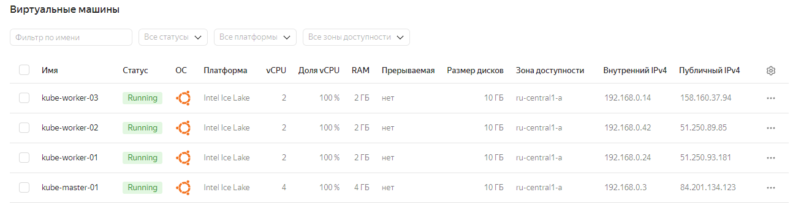

# Домашнее задание к занятию «Troubleshooting»  

### Цель задания  

Устранить неисправности при деплое приложения.  

### Чеклист готовности к домашнему заданию  

1. Кластер K8s.  

### Задание. При деплое приложение web-consumer не может подключиться к auth-db. Необходимо это исправить  

1. Установить приложение по команде:  
```
kubectl apply -f https://raw.githubusercontent.com/netology-code/kuber-homeworks/main/3.5/files/task.yaml
```
2. Выявить проблему и описать.  
3. Исправить проблему, описать, что сделано.  
4. Продемонстрировать, что проблема решена.  

-----

### Подготовка кластера к решению задания  

Создадим виртуальные машины в Яндекс Облако: 1 master и 3 worker ноды.  

  

Сконфигурируем `kube-master-01`:  

Выполним подготовку kubespray (для переменной `IPS` указываем IP-адреса виртуальных машин в Яндекс Облаке, начиная с master ноды):  
```
apt-get update -y
apt-get install git pip -y
git clone https://github.com/kubernetes-sigs/kubespray
cd kubespray
pip3 install -r requirements.txt
cp -rfp inventory/sample inventory/mycluster
declare -a IPS=(192.168.0.3 192.168.0.24 192.168.0.42 192.168.0.14)
```
 Сгенерируем inventory-файл `hosts.yaml` для Ansible с использованием заданной переменной `IPS`:  
 * Сгенерируем inventory-файл `hosts.yaml` для Ansible с использованием заданной переменной `IPS`:
```
root@node1:~/kubespray# CONFIG_FILE=inventory/mycluster/hosts.yaml python3 contrib/inventory_builder/inventory.py ${IPS[@]}
DEBUG: Adding group all
DEBUG: Adding group kube_control_plane
DEBUG: Adding group kube_node
DEBUG: Adding group etcd
DEBUG: Adding group k8s_cluster
DEBUG: Adding group calico_rr
DEBUG: adding host node1 to group all
DEBUG: adding host node2 to group all
DEBUG: adding host node3 to group all
DEBUG: adding host node4 to group all
DEBUG: adding host node1 to group etcd
DEBUG: adding host node2 to group etcd
DEBUG: adding host node3 to group etcd
DEBUG: adding host node1 to group kube_control_plane
DEBUG: adding host node2 to group kube_control_plane
DEBUG: adding host node1 to group kube_node
DEBUG: adding host node2 to group kube_node
DEBUG: adding host node3 to group kube_node
DEBUG: adding host node4 to group kube_node
```
Поправим inventory-файл `hosts.yaml` так, чтобы `node1` был master, остальные - worker. Etcd оставляем только на master:
```
root@node1:~/kubespray# cat inventory/mycluster/hosts.yaml
all:
  hosts:
    node1:
      ansible_host: 192.168.0.3
      ip: 192.168.0.3
      access_ip: 192.168.0.3
    node2:
      ansible_host: 192.168.0.24
      ip: 192.168.0.24
      access_ip: 192.168.0.24
    node3:
      ansible_host: 192.168.0.42
      ip: 192.168.0.42
      access_ip: 192.168.0.42
    node4:
      ansible_host: 192.168.0.14
      ip: 192.168.0.14
      access_ip: 192.168.0.14
  children:
    kube_control_plane:
      hosts:
        node1:
    kube_node:
      hosts:
        node2:
        node3:
        node4:
    etcd:
      hosts:
        node1:
    k8s_cluster:
      children:
        kube_control_plane:
        kube_node:
    calico_rr:
      hosts: {}
```
Копируем закрытый ключ с локальной машины на master:
```
[root@workstation ~]# rsync --rsync-path="sudo rsync" /root/.ssh/id_rsa admin@84.201.134.123:/root/.ssh/id_rsa

root@node1:~# ls .ssh/

authorized_keys  id_rsa
```
Применим конфигурацию Ansible для узлов кластера и создадим kubeconfig-файл для пользователя admin:  
```
root@node1:~/kubespray# ansible-playbook -i inventory/mycluster/hosts.yaml -u admin -b -v --private-key=/root/.ssh/id_rsa cluster.yml
------ВЫВОД------
TASK [network_plugin/calico : Check if inventory match current cluster configuration] *******************************************************************************************************************************************************
ok: [node1] => {
    "changed": false,
    "msg": "All assertions passed"
}
Tuesday 25 June 2024  10:03:34 +0000 (0:00:00.131)       0:19:43.797 ********
Tuesday 25 June 2024  10:03:34 +0000 (0:00:00.060)       0:19:43.858 ********
Tuesday 25 June 2024  10:03:34 +0000 (0:00:00.045)       0:19:43.903 ********

PLAY RECAP **********************************************************************************************************************************************************************************************************************************
localhost                  : ok=3    changed=0    unreachable=0    failed=0    skipped=0    rescued=0    ignored=0
node1                      : ok=754  changed=150  unreachable=0    failed=0    skipped=1280 rescued=0    ignored=8
node2                      : ok=514  changed=94   unreachable=0    failed=0    skipped=780  rescued=0    ignored=1
node3                      : ok=514  changed=94   unreachable=0    failed=0    skipped=779  rescued=0    ignored=1
node4                      : ok=514  changed=94   unreachable=0    failed=0    skipped=779  rescued=0    ignored=1
```
Создадим и настроим kubeconfig-файл для пользователя admin:
```
admin@node1:~$ mkdir -p $HOME/.kube
admin@node1:~$ sudo cp -i /etc/kubernetes/admin.conf $HOME/.kube/config
admin@node1:~$ sudo chown $(id -u):$(id -g) $HOME/.kube/config
```
Проверим состояние нод в кластере Kubernetes:
```
admin@node1:~$ kubectl get nodes
NAME    STATUS   ROLES           AGE     VERSION
node1   Ready    control-plane   9m27s   v1.28.2
node2   Ready    <none>          8m34s   v1.28.2
node3   Ready    <none>          8m29s   v1.28.2
node4   Ready    <none>          8m29s   v1.28.2
```
Проверим состояние подов в кластере Kubernetes:
```
admin@node1:~$ kubectl get po -A
NAMESPACE     NAME                                       READY   STATUS    RESTARTS   AGE
kube-system   calico-kube-controllers-5fb8ccdcd6-kmxjj   1/1     Running   0          14m
kube-system   calico-node-5qcv4                          1/1     Running   0          16m
kube-system   calico-node-7949w                          1/1     Running   0          16m
kube-system   calico-node-9msxv                          1/1     Running   0          16m
kube-system   calico-node-dgs7f                          1/1     Running   0          16m
kube-system   coredns-67cb94d654-bkv4s                   1/1     Running   0          14m
kube-system   coredns-67cb94d654-jkc25                   1/1     Running   0          14m
kube-system   dns-autoscaler-7b6c6d8b5b-2j9jg            1/1     Running   0          14m
kube-system   kube-apiserver-node1                       1/1     Running   1          17m
kube-system   kube-controller-manager-node1              1/1     Running   2          17m
kube-system   kube-proxy-hrgfk                           1/1     Running   0          16m
kube-system   kube-proxy-mgdwl                           1/1     Running   0          16m
kube-system   kube-proxy-q256j                           1/1     Running   0          16m
kube-system   kube-proxy-vcfr7                           1/1     Running   0          16m
kube-system   kube-scheduler-node1                       1/1     Running   1          17m
kube-system   nginx-proxy-node2                          1/1     Running   0          16m
kube-system   nginx-proxy-node3                          1/1     Running   0          16m
kube-system   nginx-proxy-node4                          1/1     Running   0          16m
kube-system   nodelocaldns-22lvx                         1/1     Running   0          14m
kube-system   nodelocaldns-82xrs                         1/1     Running   0          14m
kube-system   nodelocaldns-8wqtz                         1/1     Running   0          14m
kube-system   nodelocaldns-s6w8x                         1/1     Running   0          14m
```
Запустим предложенный в задании манифест Kubernetes и оценим результат:
```
admin@node1:~$ kubectl apply -f https://raw.githubusercontent.com/netology-code/kuber-homeworks/main/3.5/files/task.yaml
Error from server (NotFound): error when creating "https://raw.githubusercontent.com/netology-code/kuber-homeworks/main/3.5/files/task.yaml": namespaces "web" not found
Error from server (NotFound): error when creating "https://raw.githubusercontent.com/netology-code/kuber-homeworks/main/3.5/files/task.yaml": namespaces "data" not found
Error from server (NotFound): error when creating "https://raw.githubusercontent.com/netology-code/kuber-homeworks/main/3.5/files/task.yaml": namespaces "data" not found
```
В кластере не хватает namespace `web` и `data`. Создадим:
```
admin@node1:~$ kubectl create namespace web
namespace/web created
admin@node1:~$ kubectl create namespace data
namespace/data created
admin@node1:~$ kubectl get namespaces
NAME              STATUS   AGE
app               Active   1h
data              Active   36m
default           Active   1h
kube-node-lease   Active   1h
kube-public       Active   1h
kube-system       Active   1h
web               Active   36m
```
Попробуем запустить предложенный в задании манифест:
```
admin@node1:~$ kubectl apply -f https://raw.githubusercontent.com/netology-code/kuber-homeworks/main/3.5/files/task.yaml
deployment.apps/web-consumer created
deployment.apps/auth-db created
service/auth-db created
```
Развертывание прошло успешно:
```
admin@node1:~$ kubectl get all -n data -o wide
NAME                           READY   STATUS    RESTARTS   AGE     IP             NODE    NOMINATED NODE   READINESS GATES
pod/auth-db-7b5cdbdc77-zpt9c   1/1     Running   0          2m17s   10.233.71.12   node3   <none>           <none>

NAME              TYPE        CLUSTER-IP      EXTERNAL-IP   PORT(S)   AGE     SELECTOR
service/auth-db   ClusterIP   10.233.62.168   <none>        80/TCP    2m17s   app=auth-db

NAME                      READY   UP-TO-DATE   AVAILABLE   AGE     CONTAINERS   IMAGES         SELECTOR
deployment.apps/auth-db   1/1     1            1           2m17s   nginx        nginx:1.19.1   app=auth-db

NAME                                 DESIRED   CURRENT   READY   AGE     CONTAINERS   IMAGES         SELECTOR
replicaset.apps/auth-db-7b5cdbdc77   1         1         1       2m17s   nginx        nginx:1.19.1   app=auth-db,pod-template-hash=7b5cdbdc77
admin@node1:~$

admin@node1:~$ kubectl get all -n web -o wide
NAME                                READY   STATUS    RESTARTS   AGE     IP             NODE    NOMINATED NODE   READINESS GATES
pod/web-consumer-5f87765478-cv5cp   1/1     Running   0          2m24s   10.233.75.14   node2   <none>           <none>
pod/web-consumer-5f87765478-wd7mq   1/1     Running   0          2m24s   10.233.74.79   node4   <none>           <none>

NAME                           READY   UP-TO-DATE   AVAILABLE   AGE     CONTAINERS   IMAGES                    SELECTOR
deployment.apps/web-consumer   2/2     2            2           2m24s   busybox      radial/busyboxplus:curl   app=web-consumer

NAME                                      DESIRED   CURRENT   READY   AGE     CONTAINERS   IMAGES                    SELECTOR
replicaset.apps/web-consumer-5f87765478   2         2         2       2m24s   busybox      radial/busyboxplus:curl   app=web-consumer,pod-template-hash=5f87765478
```
Все ресурсы созданы корректно в пространствах имен `data` и `web`. Для дальнейшего поиска проблемы оценим логи deployment `auth-db` и `web-consumer`:
```
admin@node1:~$ kubectl logs deployment/auth-db -n data
/docker-entrypoint.sh: /docker-entrypoint.d/ is not empty, will attempt to perform configuration
/docker-entrypoint.sh: Looking for shell scripts in /docker-entrypoint.d/
/docker-entrypoint.sh: Launching /docker-entrypoint.d/10-listen-on-ipv6-by-default.sh
10-listen-on-ipv6-by-default.sh: Getting the checksum of /etc/nginx/conf.d/default.conf
10-listen-on-ipv6-by-default.sh: Enabled listen on IPv6 in /etc/nginx/conf.d/default.conf
/docker-entrypoint.sh: Launching /docker-entrypoint.d/20-envsubst-on-templates.sh
/docker-entrypoint.sh: Configuration complete; ready for start up
admin@node1:~$
admin@node1:~$ kubectl logs deployment/web-consumer -n web
Found 2 pods, using pod/web-consumer-5f87765478-cv5cp
curl: (6) Couldn't resolve host 'auth-db'
curl: (6) Couldn't resolve host 'auth-db'
-----ВЫВОД ПРОПУЩЕН-----
curl: (6) Couldn't resolve host 'auth-db'
```
Под web-consumer-5f87765478-cv5cp не может выполнить разрешение имени `auth-db`. Для уточнения ситуации попробуем выполнить разрешение имени `auth-db` изнутри пода:
```
admin@node1:~$ kubectl -n web exec pod/web-consumer-5f87765478-cv5cp -- curl auth-db
curl: (6) Couldn't resolve host 'auth-db'
command terminated with exit code 6
```
Разрешение имени не работает изнутри пода. Попробуем выполнить разрешение изнутри пода по полному имени:
```
admin@node1:~$ kubectl -n web exec pod/web-consumer-5f87765478-cv5cp -- curl auth-db.data.svc.cluster.local
  % Total    % Received % Xferd  Average Speed   Time    Time     Time  Current
                                 Dload  Upload   Total   Spent    Left  Speed
  0     0    0     0    0     0      0      0 --:--:-- --:--:-- --:--:--     0<!DOCTYPE html>
<html>
<head>
<title>Welcome to nginx!</title>
<style>
    body {
        width: 35em;
        margin: 0 auto;
        font-family: Tahoma, Verdana, Arial, sans-serif;
    }
</style>
</head>
<body>
<h1>Welcome to nginx!</h1>
<p>If you see this page, the nginx web server is successfully installed and
working. Further configuration is required.</p>

<p>For online documentation and support please refer to
<a href="http://nginx.org/">nginx.org</a>.<br/>
Commercial support is available at
<a href="http://nginx.com/">nginx.com</a>.</p>

<p><em>Thank you for using nginx.</em></p>
</body>
</html>
100   612  100   612    0     0   188k      0 --:--:-- --:--:-- --:--:--  597k
```
По полному имени разрешение изнутри пода работает. Необходимо выполнить редактирование манифеста для deployment `web-consumer`, заменив в нем сокращенное имя 'auth-db' на полное имя 'auth-db.data.svc.cluster.local' в следующем фрагменте конфигурации в блоке `- command:`:
```
spec:
  progressDeadlineSeconds: 600
  replicas: 2
  revisionHistoryLimit: 10
  selector:
    matchLabels:
      app: web-consumer
  strategy:
    rollingUpdate:
      maxSurge: 25%
      maxUnavailable: 25%
    type: RollingUpdate
  template:
    metadata:
      creationTimestamp: null
      labels:
        app: web-consumer
    spec:
      containers:
      - command:
        - sh
        - -c
        - while true; do curl auth-db.data.svc.cluster.local; sleep 5; done
        image: radial/busyboxplus:curl
        imagePullPolicy: IfNotPresent
        name: busybox
        resources: {}
        terminationMessagePath: /dev/termination-log
        terminationMessagePolicy: File
      dnsPolicy: ClusterFirst
      restartPolicy: Always
      schedulerName: default-scheduler
      securityContext: {}
      terminationGracePeriodSeconds: 30
```
Завершим редактирование манифеста и поды пересоздадутся автоматически:
```
admin@node1:~$ kubectl edit -n web deployments/web-consumer
deployment.apps/web-consumer edited
```
Проверим логи deployment `auth-db` и `web-consumer`:
```
admin@node1:~$ kubectl logs deployment/auth-db -n data
/docker-entrypoint.sh: /docker-entrypoint.d/ is not empty, will attempt to perform configuration
/docker-entrypoint.sh: Looking for shell scripts in /docker-entrypoint.d/
/docker-entrypoint.sh: Launching /docker-entrypoint.d/10-listen-on-ipv6-by-default.sh
10-listen-on-ipv6-by-default.sh: Getting the checksum of /etc/nginx/conf.d/default.conf
10-listen-on-ipv6-by-default.sh: Enabled listen on IPv6 in /etc/nginx/conf.d/default.conf
/docker-entrypoint.sh: Launching /docker-entrypoint.d/20-envsubst-on-templates.sh
/docker-entrypoint.sh: Configuration complete; ready for start up
10.233.75.14 - - [25/Jun/2024:12:13:15 +0000] "GET / HTTP/1.1" 200 612 "-" "curl/7.35.0" "-"
10.233.74.80 - - [25/Jun/2024:12:13:15 +0000] "GET / HTTP/1.1" 200 612 "-" "curl/7.35.0" "-"
10.233.71.13 - - [25/Jun/2024:12:13:15 +0000] "GET / HTTP/1.1" 200 612 "-" "curl/7.35.0" "-"
-----ВЫВОД ПРОПУЩЕН-----
10.233.71.13 - - [25/Jun/2024:12:16:23 +0000] "GET / HTTP/1.1" 200 612 "-" "curl/7.35.0" "-"

admin@node1:~$ kubectl logs deployment/web-consumer -n web
Found 2 pods, using pod/web-consumer-6fb89747cf-24lsf
  % Total    % Received % Xferd  Average Speed   Time    Time     Time  Current
                                 Dload  Upload   Total   Spent    Left  Speed
100   612  100   612    0     0   121k      0 --:--:-- --:--:-- --:--:--  298k
<!DOCTYPE html>
<html>
<head>
<title>Welcome to nginx!</title>
<style>
    body {
        width: 35em;
        margin: 0 auto;
        font-family: Tahoma, Verdana, Arial, sans-serif;
    }
</style>
</head>
<body>
<h1>Welcome to nginx!</h1>
<p>If you see this page, the nginx web server is successfully installed and
working. Further configuration is required.</p>

<p>For online documentation and support please refer to
<a href="http://nginx.org/">nginx.org</a>.<br/>
Commercial support is available at
<a href="http://nginx.com/">nginx.com</a>.</p>

<p><em>Thank you for using nginx.</em></p>
</body>
</html>
-----ВЫВОД ПРОПУЩЕН-----
```
Приложение web-consumer получило доступ к приложению auth-db. Проблема решена.
