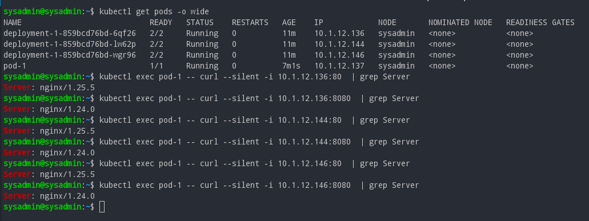
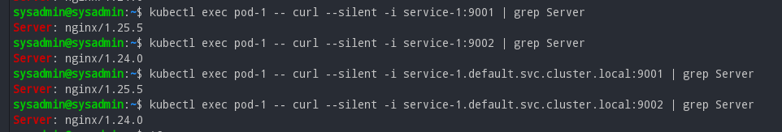
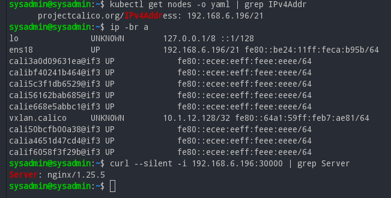

# Домашнее задание к занятию 12.4 «Сетевое взаимодействие в K8S. Часть 1»  

### Цель задания

В тестовой среде Kubernetes необходимо обеспечить доступ к приложению, установленному в предыдущем ДЗ и состоящему из двух контейнеров, по разным портам в разные контейнеры как внутри кластера, так и снаружи.

### Задание 1. Создать Deployment и обеспечить доступ к контейнерам приложения по разным портам из другого Pod внутри кластера

1. Создать Deployment приложения, состоящего из двух контейнеров (nginx и multitool), с количеством реплик 3 шт.
2. Создать Service, который обеспечит доступ внутри кластера до контейнеров приложения из п.1 по порту 9001 — nginx 80, по 9002 — multitool 8080.
3. Создать отдельный Pod с приложением multitool и убедиться с помощью `curl`, что из пода есть доступ до приложения из п.1 по разным портам в разные контейнеры.
4. Продемонстрировать доступ с помощью `curl` по доменному имени сервиса.
5. Предоставить манифесты Deployment и Service в решении, а также скриншоты или вывод команды п.4.

------

### Решение задания 1.
1. Создаем Deployment приложения, состоящего из двух контейнеров (nginx и multitool), с количеством реплик 3 шт. Подготовим следующее yaml-описание в файле [deployment-1.yaml](./configs/deployment-1.yaml):
```
---
apiVersion: apps/v1
kind: Deployment
metadata:
  name: deployment-1
  labels:
    app: deployment-1
spec:
  replicas: 3
  selector:
    matchLabels:
      app: deployment-1
  template:
    metadata:
      labels:
        app: deployment-1
    spec:
      containers:
        - name: nginx
          image: nginx
        - name: multitool
          image: wbitt/network-multitool
          env:
            - name: HTTP_PORT
              value: "8080"
            - name: HTTPS_PORT
              value: "11443"
```
* Убеждаемся, что в текущем кластере kubernetes нет лишних запущенных Pods, ReplicaSets, Deployments и Services:
```
sysadmin@sysadmin:~$  kubectl get all
NAME                 TYPE        CLUSTER-IP     EXTERNAL-IP   PORT(S)   AGE
service/kubernetes   ClusterIP   10.152.183.1   <none>        443/TCP   44h
```
* Далее запускаем развертывание Deployment (из двух контейнеров: nginx и multitool) из вышеописанного файла [deployment-1.yaml](./configs/deployment-1.yaml):
```
sysadmin@sysadmin:~$ kubectl create -f deployment-1.yaml
deployment.apps/deployment-1 created
sysadmin@sysadmin:~$ kubectl get pods
NAME                            READY   STATUS    RESTARTS   AGE
deployment-1-859bcd76bd-6qf26   2/2     Running   0          7s
deployment-1-859bcd76bd-lw62p   2/2     Running   0          7s
deployment-1-859bcd76bd-wgr96   2/2     Running   0          7s
```
2. Создаем Service, который обеспечит доступ внутри кластера до контейнеров приложения из п.1 по порту 9001 — nginx 80, по 9002 — multitool 8080. Подготовим следующее yaml-описание в файле [service-1.yaml](./configs/service-1.yaml):
```
---
apiVersion: v1
kind: Service
metadata:
  name: service-1
spec:
  selector:
    app: deployment-1
  ports:
    - name: nginx-http
      port: 9001
      targetPort: 80
    - name: multitool-http
      port: 9002
      targetPort: 8080
```
* Запускаем развертывание сервиса и проверяем его состояние:
```
sysadmin@sysadmin:~$ kubectl create -f service-1.yaml
service/service-1 created
sysadmin@sysadmin:~$ kubectl get services
NAME         TYPE        CLUSTER-IP       EXTERNAL-IP   PORT(S)             AGE
kubernetes   ClusterIP   10.152.183.1     <none>        443/TCP             45h
service-1    ClusterIP   10.152.183.147   <none>        9001/TCP,9002/TCP   9s
```
3. Создаем отдельный Pod с приложением multitool и убеждаемся с помощью `curl`, что из пода есть доступ до приложения из п.1 по разным портам в разные контейнеры. 
* Подготовим следующее yaml-описание в файле [pod-1.yaml](./configs/pod-1.yaml):
```
---
apiVersion: v1
kind: Pod
metadata:
  name: pod-1
  labels:
    app: pod-1
spec:
  containers:
    - name: multitool
      image: wbitt/network-multitool
      env:
        - name: HTTP_PORT
          value: "1080"
        - name: HTTPS_PORT
          value: "10443"
```
* Запускаем Pod:
```
sysadmin@sysadmin:~$ kubectl create -f pod-1.yaml
pod/pod-1 created
sysadmin@sysadmin:~$ kubectl get pods
NAME                            READY   STATUS    RESTARTS   AGE
deployment-1-859bcd76bd-6qf26   2/2     Running   0          4m39s
deployment-1-859bcd76bd-lw62p   2/2     Running   0          4m39s
deployment-1-859bcd76bd-wgr96   2/2     Running   0          4m39s
pod-1                           1/1     Running   0          7s
```
* Проверяем с помощью `curl`, что из пода есть доступ до приложений из п.1.(по разным портам в разные контейнеры):
```
sysadmin@sysadmin:~$ kubectl get pods -o wide
NAME                            READY   STATUS    RESTARTS   AGE    IP            NODE       NOMINATED NODE   READINESS GATES
deployment-1-859bcd76bd-6qf26   2/2     Running   0          11m    10.1.12.136   sysadmin   <none>           <none>
deployment-1-859bcd76bd-lw62p   2/2     Running   0          11m    10.1.12.144   sysadmin   <none>           <none>
deployment-1-859bcd76bd-wgr96   2/2     Running   0          11m    10.1.12.146   sysadmin   <none>           <none>
pod-1                           1/1     Running   0          7m1s   10.1.12.137   sysadmin   <none>           <none>
sysadmin@sysadmin:~$ kubectl exec pod-1 -- curl --silent -i 10.1.12.136:80  | grep Server
Server: nginx/1.25.5
sysadmin@sysadmin:~$ kubectl exec pod-1 -- curl --silent -i 10.1.12.136:8080  | grep Server
Server: nginx/1.24.0
sysadmin@sysadmin:~$ kubectl exec pod-1 -- curl --silent -i 10.1.12.144:80  | grep Server
Server: nginx/1.25.5
sysadmin@sysadmin:~$ kubectl exec pod-1 -- curl --silent -i 10.1.12.144:8080  | grep Server
Server: nginx/1.24.0
sysadmin@sysadmin:~$ kubectl exec pod-1 -- curl --silent -i 10.1.12.146:80  | grep Server
Server: nginx/1.25.5
sysadmin@sysadmin:~$ kubectl exec pod-1 -- curl --silent -i 10.1.12.146:8080  | grep Server
Server: nginx/1.24.0
```
* Видим, что pod-1 имеет доступ к открытым портам других подов. Подтвердим результат скриншотом: 

* Проверяем с помощью `curl`, что из пода есть доступ до приложений из п.1. через сервис (по портам 9001 и 9002):
```
sysadmin@sysadmin:~$ kubectl get services
NAME         TYPE        CLUSTER-IP       EXTERNAL-IP   PORT(S)             AGE
kubernetes   ClusterIP   10.152.183.1     <none>        443/TCP             45h
service-1    ClusterIP   10.152.183.147   <none>        9001/TCP,9002/TCP   12m
sysadmin@sysadmin:~$ kubectl exec pod-1 -- curl --silent -i 10.152.183.147:9001 | grep Server
Server: nginx/1.25.5
sysadmin@sysadmin:~$ kubectl exec pod-1 -- curl --silent -i 10.152.183.147:9002 | grep Server
Server: nginx/1.24.0
```
* Видим, что pod-1 имеет доступ к открытым портам сервиса. Подтвердим результат скриншотом: 

4. Продемонстрируем доступ с помощью `curl` по доменному имени сервиса (и по короткому, и по полному):
```
sysadmin@sysadmin:~$ kubectl exec pod-1 -- curl --silent -i service-1:9001 | grep Server
Server: nginx/1.25.5
sysadmin@sysadmin:~$ kubectl exec pod-1 -- curl --silent -i service-1:9002 | grep Server
Server: nginx/1.24.0
sysadmin@sysadmin:~$ kubectl exec pod-1 -- curl --silent -i service-1.default.svc.cluster.local:9001 | grep Server
Server: nginx/1.25.5
sysadmin@sysadmin:~$ kubectl exec pod-1 -- curl --silent -i service-1.default.svc.cluster.local:9002 | grep Server
Server: nginx/1.24.0
```
* Подтвердим результат скриншотом: 

5. Все манифесты представлены в файлах: 
[deployment-1.yaml](./configs/deployment-1.yaml),
[service-1.yaml](./configs/service-1.yaml),
[pod-1.yaml](./configs/pod-1.yaml).
6. Удалим лишние ресурсы (service-1 и pod-1):
```
sysadmin@sysadmin:~$ kubectl delete -f service-1.yaml
service "service-1" deleted
sysadmin@sysadmin:~$ kubectl delete -f pod-1.yaml
pod "pod-1" deleted
sysadmin@sysadmin:~$ kubectl get pods
NAME                            READY   STATUS    RESTARTS   AGE
deployment-1-859bcd76bd-6qf26   2/2     Running   0          26m
deployment-1-859bcd76bd-lw62p   2/2     Running   0          26m
deployment-1-859bcd76bd-wgr96   2/2     Running   0          26m
sysadmin@sysadmin:~$ kubectl get services
NAME         TYPE        CLUSTER-IP     EXTERNAL-IP   PORT(S)   AGE
kubernetes   ClusterIP   10.152.183.1   <none>        443/TCP   45h
```
------

### Задание 2. Создать Service и обеспечить доступ к приложениям снаружи кластера

1. Создать отдельный Service приложения из Задания 1 с возможностью доступа снаружи кластера к nginx, используя тип NodePort.
2. Продемонстрировать доступ с помощью браузера или `curl` с локального компьютера.
3. Предоставить манифест и Service в решении, а также скриншоты или вывод команды п.2.

------
1. Создаем отдельный Service приложения из Задания 1 с возможностью доступа снаружи кластера к nginx, используя тип NodePort. Подготовим следующее yaml-описание в файле [service-2.yaml](./configs/service-2.yaml):
```
---
apiVersion: v1
kind: Service
metadata:
  name: service-2
spec:
  type: NodePort
  selector:
    app: deployment-1
  ports:
    - name: nginx-http
      port: 9001
      targetPort: 80
      nodePort: 30000
```
* Запускаем развертывание сервиса и проверяем его состояние:
```
sysadmin@sysadmin:~$ kubectl create -f service-2.yaml
service/service-2 created
sysadmin@sysadmin:~$ kubectl get services
NAME         TYPE        CLUSTER-IP      EXTERNAL-IP   PORT(S)          AGE
kubernetes   ClusterIP   10.152.183.1    <none>        443/TCP          45h
service-2    NodePort    10.152.183.91   <none>        9001:30000/TCP   5s
```
2. Продемонстрируем доступ с помощью `curl` с локального компьютера (в качестве локального компьютера возьмем zabbix-sever1 с IP 192.168.1.84/16):
* Определим внешний IP-адрес ноды:
```
sysadmin@sysadmin:~$ kubectl get nodes -o yaml | grep IPv4Addr
      projectcalico.org/IPv4Address: 192.168.6.196/21
```
* Проверим доступ с помощью `curl` с локального компьютера:
```
sysadmin@sysadmin:~$ ip -br a
lo               UNKNOWN        127.0.0.1/8 ::1/128 
ens18            UP             192.168.6.196/21 fe80::be24:11ff:feca:b95b/64
sysadmin@sysadmin:~$ curl --silent -i 192.168.6.196:30000 | grep Server
Server: nginx/1.25.5
```
* Подтвердим результат скриншотом: 

3. Манифест представлен в файле [service-2.yaml](./configs/service-2.yaml).
4. Удалим созданные ресурсы:
```
sysadmin@sysadmin:~$ kubectl delete -f service-2.yaml
service "service-2" deleted
sysadmin@sysadmin:~$ kubectl delete -f deployment-1.yaml
deployment.apps "deployment-1" deleted
sysadmin@sysadmin:~$ kubectl get all
NAME                 TYPE        CLUSTER-IP     EXTERNAL-IP   PORT(S)   AGE
service/kubernetes   ClusterIP   10.152.183.1   <none>        443/TCP   45h
```
  
