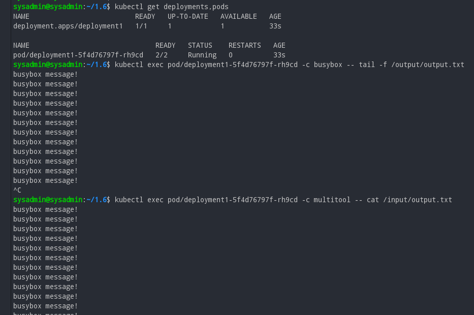
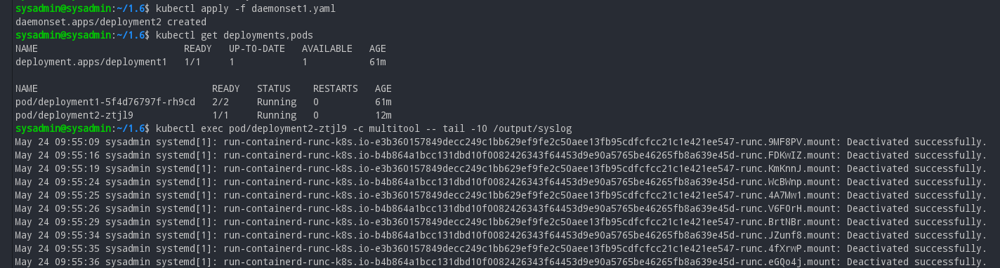

# Домашнее задание к занятию «Хранение в K8s. Часть 1»  

### Цель задания

В тестовой среде Kubernetes нужно обеспечить обмен файлами между контейнерам пода и доступ к логам ноды.

------

### Задание 1 

**Что нужно сделать**

Создать Deployment приложения, состоящего из двух контейнеров и обменивающихся данными.

1. Создать Deployment приложения, состоящего из контейнеров busybox и multitool.
2. Сделать так, чтобы busybox писал каждые пять секунд в некий файл в общей директории.
3. Обеспечить возможность чтения файла контейнером multitool.
4. Продемонстрировать, что multitool может читать файл, который периодоически обновляется.
5. Предоставить манифесты Deployment в решении, а также скриншоты или вывод команды из п. 4.

------

### Решение задания 1.

```
kubectl create ns netology

kubectl config set-context --current --namespace=netology
```
```
apiVersion: apps/v1
kind: Deployment
metadata:
  name: deployment1
  labels:
    app: dep1
spec:
  replicas: 1
  selector:
    matchLabels:
      app: dep1
  template:
    metadata:
      labels:
        app: dep1
    spec:
      containers:
      - name: busybox
        image: busybox
        command: ['sh', '-c', 'while true; do echo busybox message! >> /output/output.txt; sleep 5; done']
        volumeMounts:
        - name: dep1-volume
          mountPath: /output
      - name: multitool
        image: wbitt/network-multitool:latest
        ports:
        - containerPort: 80
        env:
        - name: HTTP_PORT
          value: "80"
        volumeMounts:
        - name: dep1-volume
          mountPath: /input
      volumes:
      - name: dep1-volume
        emptyDir: {}
```
```
sysadmin@sysadmin:~/1.6$ kubectl apply -f deployment1.yaml 
deployment.apps/deployment1 created
```
```
sysadmin@sysadmin:~/1.6$ kubectl get deployments,pods
NAME                          READY   UP-TO-DATE   AVAILABLE   AGE
deployment.apps/deployment1   1/1     1            1           33s

NAME                               READY   STATUS    RESTARTS   AGE
pod/deployment1-5f4d76797f-rh9cd   2/2     Running   0          33s
```
```
sysadmin@sysadmin:~/1.6$ kubectl exec pod/deployment1-5f4d76797f-rh9cd -c busybox -- tail -f /output/output.txt
busybox message!
busybox message!
busybox message!
busybox message!
busybox message!
busybox message!
busybox message!
busybox message!
busybox message!
busybox message!
busybox message!
```
```
sysadmin@sysadmin:~/1.6$ kubectl exec pod/deployment1-5f4d76797f-rh9cd -c multitool -- cat /input/output.txt
busybox message!
busybox message!
busybox message!
busybox message!
busybox message!
busybox message!
busybox message!
busybox message!
```


[./configs/deployment1.yaml](deployment1.yaml)

------

### Решение задания 2

**Что нужно сделать**

Создать DaemonSet приложения, которое может прочитать логи ноды.

1. Создать DaemonSet приложения, состоящего из multitool.
2. Обеспечить возможность чтения файла `/var/log/syslog` кластера MicroK8S.
3. Продемонстрировать возможность чтения файла изнутри пода.
4. Предоставить манифесты Deployment, а также скриншоты или вывод команды из п. 2.

#### Ответ на задание 2
```
apiVersion: apps/v1
kind: DaemonSet
metadata:
  name: deployment2
  labels:
    app: dep1
spec:
  selector:
    matchLabels:
      app: dep1
  template:
    metadata:
      labels:
        app: dep1
    spec:
      containers:
      - name: multitool
        image: wbitt/network-multitool
        volumeMounts:
        - name: varlog
          mountPath: /output
        ports:
        ports:
        - containerPort: 80
        env:
        - name: HTTP_PORT
          value: "80"
      volumes:
      - name: varlog
        hostPath:
          path: /var/log
```
```
sysadmin@sysadmin:~/1.6$ kubectl apply -f daemonset1.yaml 
daemonset.apps/deployment2 created
sysadmin@sysadmin:~/1.6$ kubectl get deployments,pods
NAME                          READY   UP-TO-DATE   AVAILABLE   AGE
deployment.apps/deployment1   1/1     1            1           61m

NAME                               READY   STATUS    RESTARTS   AGE
pod/deployment1-5f4d76797f-rh9cd   2/2     Running   0          61m
pod/deployment2-ztjl9              1/1     Running   0          12m
sysadmin@sysadmin:~/1.6$ kubectl exec pod/deployment2-ztjl9 -c multitool -- tail -10 /output/syslog
May 24 09:55:09 sysadmin systemd[1]: run-containerd-runc-k8s.io-e3b360157849decc249c1bb629ef9fe2c50aee13fb95cdfcfcc21c1e421ee547-runc.9MF8PV.mount: Deactivated successfully.
May 24 09:55:16 sysadmin systemd[1]: run-containerd-runc-k8s.io-b4b864a1bcc131dbd10f0082426343f64453d9e90a5765be46265fb8a639e45d-runc.FDKwIZ.mount: Deactivated successfully.
May 24 09:55:19 sysadmin systemd[1]: run-containerd-runc-k8s.io-e3b360157849decc249c1bb629ef9fe2c50aee13fb95cdfcfcc21c1e421ee547-runc.KmKnnJ.mount: Deactivated successfully.
May 24 09:55:24 sysadmin systemd[1]: run-containerd-runc-k8s.io-b4b864a1bcc131dbd10f0082426343f64453d9e90a5765be46265fb8a639e45d-runc.WcBWnp.mount: Deactivated successfully.
May 24 09:55:25 sysadmin systemd[1]: run-containerd-runc-k8s.io-e3b360157849decc249c1bb629ef9fe2c50aee13fb95cdfcfcc21c1e421ee547-runc.4A7Mw1.mount: Deactivated successfully.
May 24 09:55:26 sysadmin systemd[1]: run-containerd-runc-k8s.io-b4b864a1bcc131dbd10f0082426343f64453d9e90a5765be46265fb8a639e45d-runc.V6FOrH.mount: Deactivated successfully.
May 24 09:55:29 sysadmin systemd[1]: run-containerd-runc-k8s.io-e3b360157849decc249c1bb629ef9fe2c50aee13fb95cdfcfcc21c1e421ee547-runc.BrtNBr.mount: Deactivated successfully.
May 24 09:55:34 sysadmin systemd[1]: run-containerd-runc-k8s.io-b4b864a1bcc131dbd10f0082426343f64453d9e90a5765be46265fb8a639e45d-runc.JZunf8.mount: Deactivated successfully.
May 24 09:55:35 sysadmin systemd[1]: run-containerd-runc-k8s.io-e3b360157849decc249c1bb629ef9fe2c50aee13fb95cdfcfcc21c1e421ee547-runc.4fXrwP.mount: Deactivated successfully.
May 24 09:55:36 sysadmin systemd[1]: run-containerd-runc-k8s.io-b4b864a1bcc131dbd10f0082426343f64453d9e90a5765be46265fb8a639e45d-runc.eGQo4j.mount: Deactivated successfully.
```

  

[./configs/daemonset1.yaml](daemonset1.yaml)  

Удалим все развернутые ресурсы
```
sysadmin@sysadmin:~/1.6$ kubectl delete -f deployment1.yaml 
deployment.apps "deployment1" deleted
sysadmin@sysadmin:~/1.6$ kubectl delete -f daemonset1.yaml 
daemonset.apps "deployment2" deleted
sysadmin@sysadmin:~/1.6$ kubectl get all
NAME                 TYPE        CLUSTER-IP     EXTERNAL-IP   PORT(S)   AGE
service/kubernetes   ClusterIP   10.152.183.1   <none>        443/TCP   8d
```
